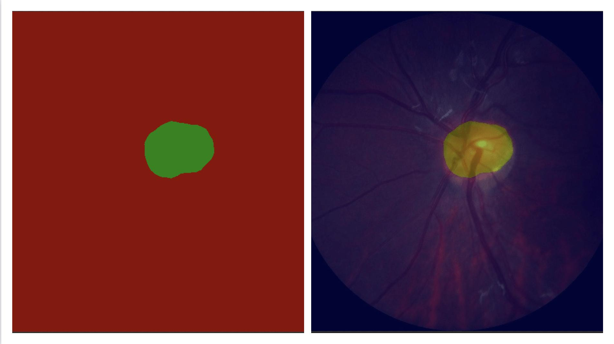
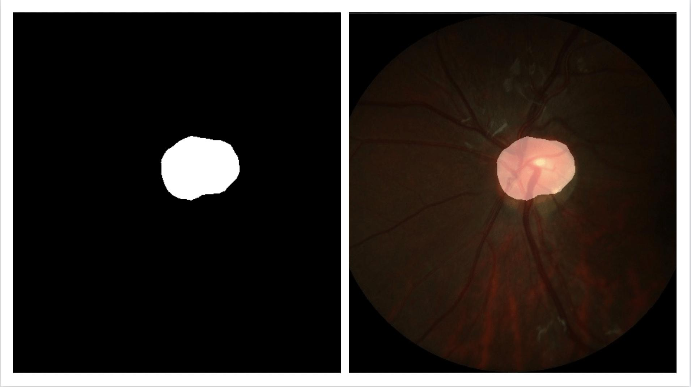

简体中文|[English](predict.md)
# 预测

除了分析模型的IOU、ACC和Kappa指标之外，我们还可以查阅一些具体样本的切割样本效果，从Bad Case启发进一步优化的思路。

predict.py脚本是专门用来可视化预测案例的，命令格式如下所示：

```
python predict.py \
       --config configs/quick_start/bisenet_optic_disc_512x512_1k.yml \
       --model_path output/iter_1000/model.pdparams \
       --image_path dataset/optic_disc_seg/JPEGImages/H0003.jpg \
       --save_dir output/result
```

其中`image_path`也可以是一个目录，这时候将对目录内的所有图片进行预测并保存可视化结果图。

同样的，可以通过`--aug_pred`开启多尺度翻转预测， `--is_slide`开启滑窗预测。


## 1.准备预测数据

- 在执行预测时，仅需要原始图像。你应该准备好 `test.txt` 的内容，如下所示：
    ```
    images/image1.jpg
    images/image2.jpg
    ...
    ```

- 在调用`predict.py`进行可视化展示时，文件列表中可以包含标注图像。在预测时，模型将自动忽略文件列表中给出的标注图像。因此，你也可以直接使用训练、验证数据集进行预测。也就是说，如果你的`train.txt`的内容如下：
    ```
    images/image1.jpg labels/label1.png
    images/image2.jpg labels/label2.png
    ...
    ```

* 此时你可以在预测时将`image_list`指定为`train.txt`，将`image_dir`指定为训练数据所在的目录。PaddleSeg的鲁棒性允许你这样做，输出的结果将是对**原始训练数据**的预测结果。

## 2.预测函数API
预测API的参数解析

```
paddleseg.core.predict(
                    model,
                    model_path,
                    transforms,
                    image_list,
                    image_dir=None,
                    save_dir='output',
                    aug_pred=False,
                    scales=1.0,
                    flip_horizontal=True,
                    flip_vertical=False,
                    is_slide=False,
                    stride=None,
                    crop_size=None,
                    custom_color=None
)
```

- 参数说明如下

| 参数名          | 数据类型          | 用途                                                 | 是否必选项 | 默认值   |
| --------------- | ----------------- | ---------------------------------------------------- | ---------- | -------- |
| model           | nn.Layer          | 分割模型                                             | 是         | -        |
| model_path      | str               | 训练最优模型的路径                                   | 是         | -        |
| transforms      | transform.Compose | 对输入图像进行预处理                                 | 是         | -        |
| image_list      | list              | 待预测的图像路径列表                                 | 是         | -        |
| image_dir       | str               | 待要预测的图像路径目录                               | 否         | None     |
| save_dir        | str               | 结果输出路径                                         | 否         | 'output' |
| aug_pred        | bool              | 是否使用多尺度和翻转增广进行预测                     | 否         | False    |
| scales          | list/float        | 设置缩放因子，`aug_pred`为True时生效                   | 否         | 1.0      |
| flip_horizontal | bool              | 是否使用水平翻转，`aug_eval`为True时生效               | 否         | True     |
| flip_vertical   | bool              | 是否使用垂直翻转，`aug_eval`为True时生效               | 否         | False    |
| is_slide        | bool              | 是否通过滑动窗口进行评估                             | 否         | False    |
| stride          | tuple/list        | 设置滑动窗宽的宽度和高度，`is_slide`为True时生效       | 否         | None     |
| crop_size       | tuple/list        | 设置滑动窗口的裁剪的宽度和高度，`is_slide`为True时生效 | 否         | None     |
| custom_color    | list              | 设置自定义分割预测颜色，len(custom_color) = 3 * 像素种类  | 否        | 预设color map |

导入API接口，开始预测

```
from paddleseg.core import predict
predict(
        model,
        model_path='output/best_model/model.pdparams',# 模型路径
        transforms=transforms, #transform.Compose， 对输入图像进行预处理
        image_list=image_list, #list,待预测的图像路径列表。
        image_dir=image_dir, #str，待预测的图片所在目录
        save_dir='output/results' #str，结果输出路径
    )
```

## 3.输出文件说明
如果你不指定输出位置，在默认文件夹`output/results`下将生成两个文件夹`added_prediction`与`pseudo_color_prediction`, 分别存放叠加效果图与预测mask的结果。

    output/result
        |
        |--added_prediction
        |  |--image1.jpg
        |  |--image2.jpg
        |  |--...
        |
        |--pseudo_color_prediction
        |  |--image1.jpg
        |  |--image2.jpg
        |  |--...


## 4.自定义color map
经过预测后，我们得到的是默认color map配色的预测分割结果。以视盘分割为例：


​                                                                                            伪彩色标注图/叠加图

在该分割结果中，前景以红色标明，背景以黑色标明。如果你想要使用其他颜色，可以参考如下命令：
```python
python predict.py \
       --config configs/quick_start/bisenet_optic_disc_512x512_1k.yml \
       --model_path output/iter_1000/model.pdparams \
       --image_path data/optic_disc_seg/JPEGImages/H0003.jpg \
       --save_dir output/result \
       --custom_color 0 0 0 255 255 255
```
分割预测结果如下：


​                                                                                            伪彩色标注图/叠加图

- 参数解析
- 可以看到我们在最后添加了 `--custom_color 0 0 0 255 255 255`，这是什么意思呢？在RGB图像中，每个像素最终呈现出来的颜色是由RGB三个通道的分量共同决定的，因此该命令行参数后每三位代表一种像素的颜色，位置与`label.txt`中各类像素点一一对应。
- 如果使用自定义color map，输入的`color值`的个数应该等于`3 * 像素种类`（取决于你所使用的数据集）。比如，你的数据集有 3 种像素，则可考虑执行:
```python
python predict.py \
       --config configs/quick_start/bisenet_optic_disc_512x512_1k.yml \
       --model_path output/iter_1000/model.pdparams \
       --image_path data/optic_disc_seg/JPEGImages/H0003.jpg \
       --save_dir output/result \
       --custom_color 0 0 0 100 100 100 200 200 200
```

我们建议你参照RGB颜色数值对照表来设置`--custom_color`。
