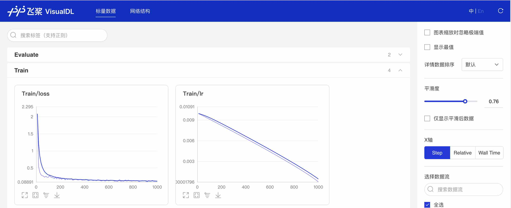
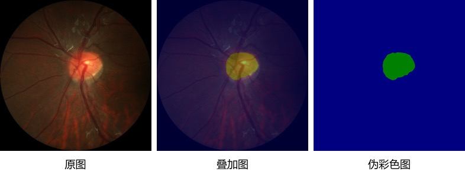

# 快速开始

本教程提供了一个快速入门的使用示例，用于训练一个基于视盘分割数据集的BiSeNetv2模型。
为了快速完成整体教程，我们将训练的迭代次数设置为1000（以Tesla V100为例，训练时间大约为5min）。
在了解完整体使用流程后，关于标准数据集的训练请参考[模型库](../configs)的训练配置，动手训练一个模型以体验实际训练效果。
- [模型训练](#模型训练)
- [训练可视化](#训练可视化)
- [模型评估](#模型评估)
- [效果可视化](#效果可视化)

## 模型训练

我们可以通过PaddleSeg提供的脚本对模型进行训练，请确保完成了PaddleSeg的安装工作，并且位于PaddleSeg/dygraph目录下，执行以下脚本：

```shell
export CUDA_VISIBLE_DEVICES=0 # 设置1张可用的卡
# windows下请执行以下命令
# set CUDA_VISIBLE_DEVICES=0
python train.py \
       --config configs/quick_start/bisenet_optic_disc_512x512_1k.yml \
       --do_eval \
       --use_vdl \
       --save_interval 500 \
       --save_dir output
```

### 训练参数解释

|参数名|用途|是否必选项|默认值|
|-|-|-|-|
|iters|训练迭代次数|否|配置文件中指定值|
|batch_size|单卡batch size|否|配置文件中指定值|
|learning_rate|初始学习率|否|配置文件中指定值|
|config|配置文件|是|-|
|save_dir|模型和visualdl日志文件的保存根路径|否|output|
|num_workers|用于异步读取数据的进程数量， 大于等于1时开启子进程读取数据|否|0|
|use_vdl|是否开启visualdl记录训练数据|否|否|
|save_interval_iters|模型保存的间隔步数|否|1000|
|do_eval|是否在保存模型时启动评估, 启动时将会根据mIoU保存最佳模型至best_model|否|否|
|log_iters|打印日志的间隔步数|否|10|
|resume_model|恢复训练模型路径，如：`output/iter_1000`|否|None|


**注意**：如果想要使用多卡训练的话，需要将环境变量CUDA_VISIBLE_DEVICES指定为多卡（不指定时默认使用所有的gpu)，并使用paddle.distributed.launch启动训练脚本（windows下由于不支持nccl，无法使用多卡训练）:
```shell
export CUDA_VISIBLE_DEVICES=0,1,2,3 # 设置4张可用的卡
python -m paddle.distributed.launch train.py \
       --config configs/quick_start/bisenet_optic_disc_512x512_1k.yml \
       --do_eval \
       --use_vdl \
       --save_interval 500 \
       --save_dir output
```

恢复训练：
```shell
python train.py \
       --config configs/quick_start/bisenet_optic_disc_512x512_1k.yml \
       --resume_model output/iter_500 \
       --do_eval \
       --use_vdl \
       --save_interval 500 \
       --save_dir output
```

## 训练可视化

PaddleSeg会将训练过程中的数据写入VisualDL文件，并实时的查看训练过程中的日志，记录的数据包括：
1. loss变化趋势
2. 学习率变化趋势
3. 训练时间
4. 数据读取时间
5. mean IoU变化趋势（当打开了`do_eval`开关后生效）
6. mean pixel Accuracy变化趋势（当打开了`do_eval`开关后生效）

使用如下命令启动VisualDL查看日志
```shell
# 下述命令会在127.0.0.1上启动一个服务，支持通过前端web页面查看，可以通过--host这个参数指定实际ip地址
visualdl --logdir output/
```

在浏览器输入提示的网址，效果如下：



## 模型评估

当保存完模型后，我们可以通过PaddleSeg提供的脚本对模型进行评估
```shell
python val.py \
       --config configs/quick_start/bisenet_optic_disc_512x512_1k.yml \
       --model_path output/iter_1000/model.pdparams
```

如果想进行多尺度翻转评估可通过传入`--aug_eval`进行开启，然后通过`--scales`传入尺度信息，
`--flip_horizontal`开启水平翻转， `flip_vertical`开启垂直翻转。使用示例如下：
```shell
python val.py \
       --config configs/quick_start/bisenet_optic_disc_512x512_1k.yml \
       --model_path output/iter_1000/model.pdparams \
       --aug_eval \
       --scales 0.75 1.0 1.25 \
       --flip_horizontal
```

如果想进行滑窗评估可通过传入`--is_slide`进行开启， 通过`--crop_size`传入窗口大小， `--stride`传入步长。使用示例如下：
```shell
python val.py \
       --config configs/quick_start/bisenet_optic_disc_512x512_1k.yml \
       --model_path output/iter_1000/model.pdparams \
       --is_slide \
       --crop_size 256 256 \
       --stride 128 128
```

## 效果可视化
当保存完模型后，可以通过PaddleSeg提供的脚本对模型预测结果进行可视化，查看分割效果。
```shell
python predict.py \
       --config configs/quick_start/bisenet_optic_disc_512x512_1k.yml \
       --model_path output/iter_1000/model.pdparams \
       --image_path data/optic_disc_seg/JPEGImages/H0003.jpg \
       --save_dir output/result
```
其中`image_path`也可以是一个目录，这时候将对目录内的所有图片进行预测并保存可视化结果图。效果如下：


同样的，可以通过`--aug_pred`开启多尺度翻转预测， `--is_slide`开启滑窗预测。

