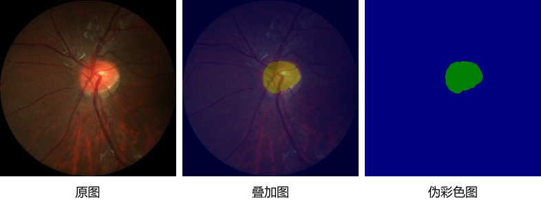

[English](./quick_start.md) | 简体中文

# 快速开始

为了让大家快速了解PaddleSeg，本文档使用一个简单示例进行演示。在实际业务中，建议大家根据实际情况进行调整适配。

在开始下面示例之前，请大家确保已经安装好PaddleSeg开发环境（[安装说明](./install_cn.md)）。

## 1 准备数据

本示例将使用视盘分割（optic disc segmentation）数据集，数据集的原始图像和分割效果图如下所示。

<div align="center">
  
</div>


通过以下命令可以下载视盘分割数据集([下载链接](https://paddleseg.bj.bcebos.com/dataset/optic_disc_seg.zip)），解压保存到`PaddleSeg/data`目录下。

```
cd PaddleSeg
mkdir data
cd data
wget https://paddleseg.bj.bcebos.com/dataset/optic_disc_seg.zip
unzip optic_disc_seg.zip
cd ..
```

## 2 准备配置文件

我们常用PaddleSeg**配置化驱动方式**进行开发，配置文件是模型训练、评估、预测和部署的关键。

配置文件中定义了分割模型、损失函数、训练超参、训练数据集、验证数据集等信息。

本示例使用的配置文件是：`PaddleSeg/configs/quick_start/pp_liteseg_optic_disc_512x512_1k.yml`

## 3 模型训练

在PaddleSeg根目录下，执行如下命令进行单机训练。

```
export CUDA_VISIBLE_DEVICES=0 # Linux下设置1张可用的卡
# set CUDA_VISIBLE_DEVICES=0 # Windows下设置1张可用的卡

python train.py \
       --config configs/quick_start/pp_liteseg_optic_disc_512x512_1k.yml \
       --save_interval 500 \
       --do_eval \
       --use_vdl \
       --save_dir output
```

训练完成后，模型在验证集上的mIoU达到90.65%(数据可能变动)，模型权重保存在`PaddleSeg/output/`。

## 4 模型评估

在PaddleSeg根目录下，执行如下命令使用`val.py`脚本来评估模型的精度，即计算验证数据集的精度。

```
python val.py \
       --config configs/quick_start/pp_liteseg_optic_disc_512x512_1k.yml \
       --model_path output/best_model/model.pdparams
```

## 5 模型预测

在PaddleSeg根目录下，执行如下命令使用`predict.py`脚本加载模型，对图像进行预测，并且保存预测结果。

```
python predict.py \
       --config configs/quick_start/pp_liteseg_optic_disc_512x512_1k.yml \
       --model_path output/best_model/model.pdparams \
       --image_path data/optic_disc_seg/JPEGImages/H0002.jpg \
       --save_dir output/result
```

预测完成，可以在`PaddleSeg/output/result`目录下查看预测结果，如下图。

<div align="center">
  
</div>

## 6 后续

上述模型训练、评估、训练完后，就可以导出并部署预测模型了，具体请参考PaddleSeg的详细文档。
