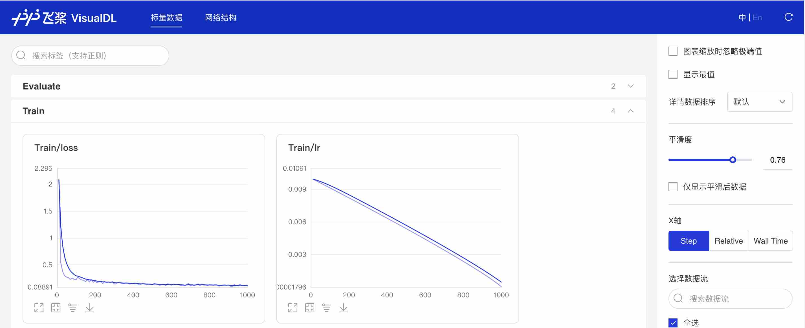

简体中文|[English](train.md)
# 模型训练

## 1、开启训练
我们可以通过PaddleSeg提供的脚本对模型进行训练，在本文档中我们使用`BiseNet`模型与`optic_disc`数据集展示训练过程。 请确保已经完成了PaddleSeg的安装工作，并且位于PaddleSeg目录下，执行以下脚本：

```shell
export CUDA_VISIBLE_DEVICES=0 # 设置1张可用的卡
# windows下请执行以下命令
# set CUDA_VISIBLE_DEVICES=0
python train.py \
       --config configs/quick_start/bisenet_optic_disc_512x512_1k.yml \
       --do_eval \
       --use_vdl \
       --save_interval 500 \
       --save_dir output
```

### 训练参数解释

| 参数名              | 用途                                                         | 是否必选项 | 默认值           |
| :------------------ | :----------------------------------------------------------- | :--------- | :--------------- |
| iters               | 训练迭代次数                                                 | 否         | 配置文件中指定值 |
| batch_size          | 单卡batch size                                               | 否         | 配置文件中指定值 |
| learning_rate       | 初始学习率                                                   | 否         | 配置文件中指定值 |
| config              | 配置文件                                                     | 是         | -                |
| save_dir            | 模型和visualdl日志文件的保存根路径                           | 否         | output           |
| num_workers         | 用于异步读取数据的进程数量， 大于等于1时开启子进程读取数据   | 否         | 0                |
| use_vdl             | 是否开启visualdl记录训练数据                                 | 否         | 否               |
| save_interval       | 模型保存的间隔步数                                           | 否         | 1000             |
| do_eval             | 是否在保存模型时启动评估, 启动时将会根据mIoU保存最佳模型至best_model | 否         | 否               |
| log_iters           | 打印日志的间隔步数                                           | 否         | 10               |
| resume_model        | 恢复训练模型路径，如：`output/iter_1000`                     | 否         | None             |
| keep_checkpoint_max | 最新模型保存个数                                             | 否         | 5                |

## 2、多卡训练
如果想要使用多卡训练的话，需要将环境变量CUDA_VISIBLE_DEVICES指定为多卡（不指定时默认使用所有的gpu)，并使用paddle.distributed.launch启动训练脚本（windows下由于不支持nccl，无法使用多卡训练）:

```shell
export CUDA_VISIBLE_DEVICES=0,1,2,3 # 设置4张可用的卡
python -m paddle.distributed.launch train.py \
       --config configs/quick_start/bisenet_optic_disc_512x512_1k.yml \
       --do_eval \
       --use_vdl \
       --save_interval 500 \
       --save_dir output
```

## 3、恢复训练：
```shell
python train.py \
       --config configs/quick_start/bisenet_optic_disc_512x512_1k.yml \
       --resume_model output/iter_500 \
       --do_eval \
       --use_vdl \
       --save_interval 500 \
       --save_dir output
```

## 4、训练可视化

PaddleSeg会将训练过程中的数据写入VisualDL文件，并实时的查看训练过程中的日志，记录的数据包括：
1. loss变化趋势
2. 学习率变化趋势
3. 训练时间
4. 数据读取时间
5. mean IoU变化趋势（当打开了`do_eval`开关后生效）
6. mean pixel Accuracy变化趋势（当打开了`do_eval`开关后生效）

使用如下命令启动VisualDL查看日志
```shell
# 下述命令会在127.0.0.1上启动一个服务，支持通过前端web页面查看，可以通过--host这个参数指定实际ip地址
visualdl --logdir output/
```

在浏览器输入提示的网址，效果如下：

