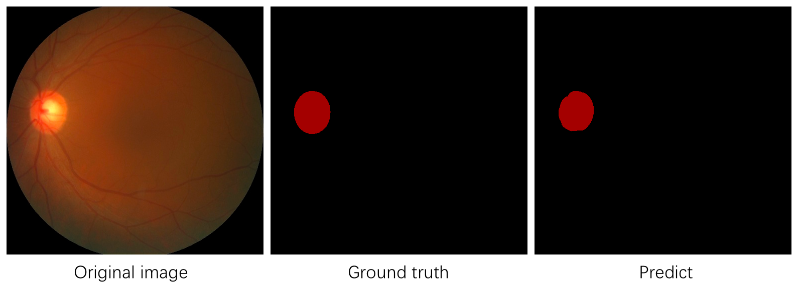

# 训练/评估/可视化

PaddleSeg提供了 **训练**/**评估**/**可视化** 等三个功能的使用脚本。三个脚本都支持通过不同的Flags来开启特定功能，也支持通过Options来修改默认的[训练配置](./config.md)。三者的使用方式非常接近，如下：

```shell
# 训练
python pdseg/train.py ${FLAGS} ${OPTIONS}
# 评估
python pdseg/eval.py ${FLAGS} ${OPTIONS}
# 可视化
python pdseg/vis.py ${FLAGS} ${OPTIONS}
```

**Note:**

* FLAGS必须位于OPTIONS之前，否会将会遇到报错，例如如下的例子:

```shell
# FLAGS "--cfg configs/cityscapes.yaml" 必须在 OPTIONS "BATCH_SIZE 1" 之前
python pdseg/train.py BATCH_SIZE 1 --cfg configs/unet_pet.yaml
```

## 命令行FLAGS列表

|FLAG|支持脚本|用途|默认值|备注|
|-|-|-|-|-|
|--cfg|ALL|配置文件路径|None||
|--use_gpu|ALL|是否使用GPU进行训练|False||
|--use_mpio|train/eval|是否使用多进程进行IO处理|False|打开该开关会占用一定量的CPU内存，但是可以提高训练速度。</br> **NOTE：** windows平台下不支持该功能, 建议使用自定义数据初次训练时不打开，打开会导致数据读取异常不可见。 </br> |
|--use_tb|train|是否使用TensorBoard记录训练数据|False||
|--log_steps|train|训练日志的打印周期（单位为step）|10||
|--debug|train|是否打印debug信息|False|IOU等指标涉及到混淆矩阵的计算，会降低训练速度|
|--tb_log_dir|train|TensorBoard的日志路径|None||
|--do_eval|train|是否在保存模型时进行效果评估|False||
|--vis_dir|vis|保存可视化图片的路径|"visual"||

## OPTIONS

详见[训练配置](./config.md)

## 使用示例
下面通过一个简单的示例，说明如何基于PaddleSeg提供的预训练模型启动训练。我们选择基于COCO数据集预训练的unet模型作为预训练模型，在一个Oxford-IIIT Pet数据集上进行训练。
**Note:** 为了快速体验，我们使用Oxford-IIIT Pet做了一个小型数据集，后续数据都使用该小型数据集。

### 准备工作
在开始教程前，请先确认准备工作已经完成：
1. 正确安装了PaddlePaddle
2. PaddleSeg相关依赖已经安装

如果有不确认的地方，请参考[安装说明](./installation.md)

### 下载预训练模型
```shell
# 下载预训练模型并进行解压
python pretrained_model/download_model.py unet_bn_coco
```
### 下载Oxford-IIIT Pet数据集
我们使用了Oxford-IIIT中的猫和狗两个类别数据制作了一个小数据集mini_pet，用于快速体验。
更多关于数据集的介绍情参考[Oxford-IIIT Pet](https://www.robots.ox.ac.uk/~vgg/data/pets/)

```shell
# 下载预训练模型并进行解压
python dataset/download_pet.py
```

### 模型训练

为了方便体验，我们在configs目录下放置了mini_pet所对应的配置文件`unet_pet.yaml`，可以通过`--cfg`指向该文件来设置训练配置。

我们选择GPU 0号卡进行训练，这可以通过环境变量`CUDA_VISIBLE_DEVICES`来指定。

```
export CUDA_VISIBLE_DEVICES=0
python pdseg/train.py --use_gpu \
                      --do_eval \
                      --use_tb \
                      --tb_log_dir train_log \
                      --cfg configs/unet_pet.yaml \
                      BATCH_SIZE 4 \
                      TRAIN.PRETRAINED_MODEL_DIR pretrained_model/unet_bn_coco \
                      SOLVER.LR 5e-5
```


**NOTE:**

* 上述示例中，一共存在三套配置方案: PaddleSeg默认配置/unet_pet.yaml/OPTIONS，三者的优先级顺序为 OPTIONS > yaml > 默认配置。这个原则对于train.py/eval.py/vis.py都适用

* 如果发现因为内存不足而Crash。请适当调低BATCH_SIZE。如果本机GPU内存充足，则可以调高BATCH_SIZE的大小以获得更快的训练速度，BATCH_SIZE增大时，可以适当调高学习率。

* 如果在Linux系统下训练，可以使用`--use_mpio`使用多进程I/O，通过提升数据增强的处理速度进而大幅度提升GPU利用率。


### 训练过程可视化

当打开do_eval和use_tb两个开关后，我们可以通过TensorBoard查看边训练边评估的效果。

```shell
tensorboard --logdir train_log --host {$HOST_IP} --port {$PORT}
```

NOTE:
1. 上述示例中，$HOST\_IP为机器IP地址，请替换为实际IP，$PORT请替换为可访问的端口
2. 数据量较大时，前端加载速度会比较慢，请耐心等待

启动TensorBoard命令后，我们可以在浏览器中查看对应的训练数据
在`SCALAR`这个tab中，查看训练loss、iou、acc的变化趋势


在`IMAGE`这个tab中，查看样本的预测情况


### 模型评估
训练完成后，我们可以通过eval.py来评估模型效果。由于我们设置的训练EPOCH数量为100，保存间隔为10，因此一共会产生10个定期保存的模型，加上最终保存的final模型，一共有11个模型。我们选择最后保存的模型进行效果的评估：

```shell
python pdseg/eval.py --use_gpu \
                     --cfg configs/unet_pet.yaml \
                     TEST.TEST_MODEL saved_model/unet_pet/final
```

可以看到，在经过训练后，模型在验证集上的mIoU指标达到了0.70+（由于随机种子等因素的影响，效果会有小范围波动，属于正常情况）。

### 模型可视化
通过vis.py来评估模型效果，我们选择最后保存的模型进行效果的评估：
```shell
python pdseg/vis.py --use_gpu \
                     --cfg configs/unet_pet.yaml \
                     TEST.TEST_MODEL saved_model/unet_pet/final
```
执行上述脚本后，会在主目录下产生一个visual文件夹，里面存放着测试集图片的预测结果，我们选择其中几张图片进行查看，可以看到，在测试集中的图片上的预测效果已经很不错：



`NOTE`
1. 可视化的图片会默认保存在visual目录下，可以通过`--vis_dir`来指定输出目录
2. 训练过程中会使用DATASET.VIS_FILE_LIST中的图片进行可视化显示，而vis.py则会使用DATASET.TEST_FILE_LIST
