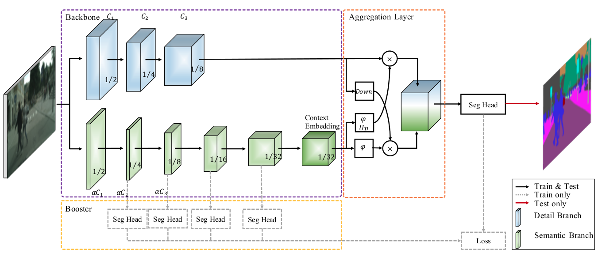
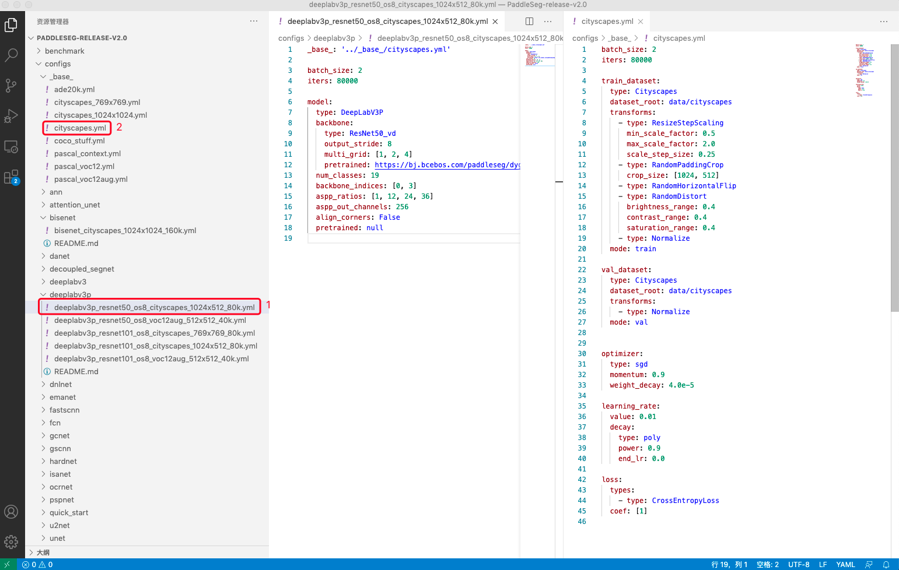
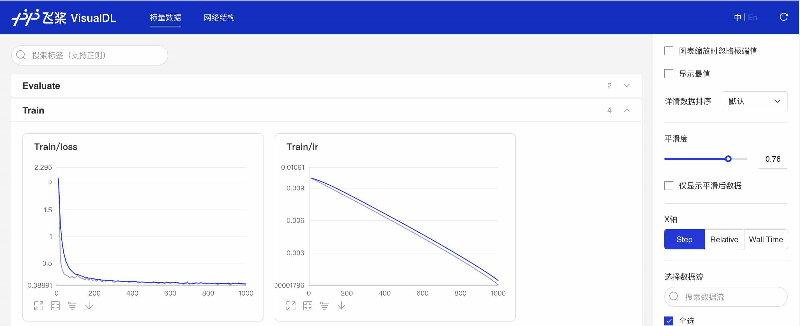
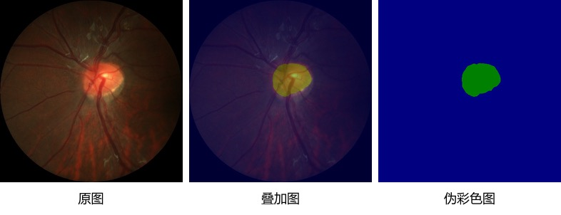

简体中文 | [English](whole_process.md)
# PaddleSeg全流程跑通

我们将以`BiSeNetV2`和`医学视盘分割数据集`为例介绍PaddleSeg的**配置化驱动**使用方式。如果想了解API调用的使用方法，可点击[PaddleSeg高级教程](https://aistudio.baidu.com/aistudio/projectdetail/1339458?channelType=0&channel=0)。

PaddleSeg的使用流程如下：

1. 准备环境：使用PaddleSeg的软件环境
2. 准备数据：用户如何准备、整理自定义数据集
3. 模型训练：训练配置和启动训练命令
4. 可视化训练过程：使用VDL展示训练过程
5. 模型评估：评估模型效果
6. 模型预测与可视化：使用训练好的模型进行预测，同时对结果进行可视化
7. 模型导出：如何导出可进行部署的模型
8. 模型部署：快速使用Python实现高效部署

## **1. 环境安装与验证**

### **1.1 环境安装**

在使用PaddleSeg训练图像分割模型之前，用户需要完成如下任务：

1. 安装[Python3.6或更高版本](https://www.python.org/downloads/)。
2. 安装`PaddlePaddle 2.1`版本，具体安装方法请参见[快速安装](https://www.paddlepaddle.org.cn/install/quick)。由于图像分割模型计算开销大，推荐在GPU版本的PaddlePaddle下使用PaddleSeg。
3. 下载PaddleSeg的代码库。

```
git clone https://github.com/PaddlePaddle/PaddleSeg.git
```
```
#如果github下载网络较差，用户可选择gitee进行下载
git clone https://gitee.com/paddlepaddle/PaddleSeg.git
```
安装Paddleseg API库，在安装该库的同时，运行PaddleSeg的其他依赖项也被同时安装
```
pip install paddleseg
```

### **1.2 确认环境安装成功**

下述命令均在PaddleSeg目录下完成

执行下面命令，如果在PaddleSeg/output文件夹中出现预测结果，则证明安装成功

```
python predict.py \
       --config configs/quick_start/bisenet_optic_disc_512x512_1k.yml \
       --model_path https://bj.bcebos.com/paddleseg/dygraph/optic_disc/bisenet_optic_disc_512x512_1k/model.pdparams\
       --image_path docs/images/optic_test_image.jpg \
       --save_dir output/result
```

## **2. 数据集下载与说明**

**数据集下载**

本章节将使用视盘分割（optic disc segmentation）数据集进行训练，视盘分割是一组眼底医疗分割数据集，包含了267张训练图片、76张验证图片、38张测试图片。通过以下命令可以下载该数据集。

数据集的原图和效果图如下所示，我们的任务将是将眼球图片中的视盘区域分割出来。


​                                                                                            图1：数据集的原图和效果图


```
#下载并解压数据集
mkdir dataset
cd dataset
wget https://paddleseg.bj.bcebos.com/dataset/optic_disc_seg.zip
unzip optic_disc_seg.zip
cd ..
```

## **2.1 准备数据集**

如何使用自己的数据集进行训练是开发者最关心的事情，下面我们将着重说明一下如果要自定义数据集，我们该准备成什么样子？以及数据集准备好后，如何在配置文件中作出相应改动。

### **2.1.1 整理数据集**

- 推荐整理成如下结构

        custom_dataset
        |
        |--images
        |  |--image1.jpg
        |  |--image2.jpg
        |  |--...
        |
        |--labels
        |  |--label1.png
        |  |--label2.png
        |  |--...
        |
        |--train.txt
        |
        |--val.txt
        |
        |--test.txt

- 文件夹命名为custom_dataset、images、labels不是必须，用户可以自主进行命名。

- train.txt val.txt test.txt中文件并非要和custom_dataset文件夹在同一目录下，可以通过配置文件中的选项修改.

 其中train.txt和val.txt的内容如下所示：

  ```

   images/image1.jpg labels/label1.png
   images/image2.jpg labels/label2.png
   ...
  ```

我们刚刚下载的数据集格式也与之类似(label.txt可有可以无)，如果用户要进行数据集标注和数据划分，请参考[数据标注文档](data/marker/marker_cn.md)与[数据集划分文档](data/custom/data_prepare_cn.md)。

我们一般推荐用户将数据集放置在PaddleSeg下的dataset文件夹下。

## **3. 模型训练**

- 在这里选择BiseNetV2模型，BiseNetV2是一个轻量化模型，在Cityscapes测试集中的平均IoU达到72.6％，在一张NVIDIA GeForce GTX 1080 Ti卡上的速度为156 FPS，这比现有方法要快得多，而且可以实现更好的分割精度。

### **3.1 BiseNetV2模型介绍**

双边分割网络(BiSeNet V2)，将低层次的网络细节和高层次的语义分类分开处理，以实现高精度和高效率的实时语义分割。它在速度和精度之间进行权衡。该体系结构包括：

(1)一个细节分支，具有浅层宽通道，用于捕获低层细节并生成高分辨率的特征表示。

(2)一个语义分支，通道窄，层次深，获取高层次语义语境。语义分支是轻量级的，因为它减少了通道容量和快速下采样策略。此外，设计了一个引导聚合层来增强相互连接和融合这两种类型的特征表示。此外，还设计了一种增强型训练策略，在不增加任何推理代价的情况下提高分割性能。



​                                                                                                          图2：数据集的原图和效果图

### **3.2 配置文件详细解读**

在了解完BiseNetV2原理后，我们便可准备进行训练了。上文中我们谈到PaddleSeg提供了**配置化驱动**进行模型训练。那么在训练之前，先来了解一下配置文件，在这里我们以`bisenet_optic_disc_512x512_1k.yml`为例子说明，该yaml格式配置文件包括模型类型、骨干网络、训练和测试、预训练数据集和配套工具（如数据增强）等信息。

PaddleSeg在配置文件中详细列出了每一个可以优化的选项，用户只要修改这个配置文件就可以对模型进行定制（**所有的配置文件在PaddleSeg/configs文件夹下面**），如自定义模型使用的骨干网络、模型使用的损失函数以及关于网络结构等配置。除了定制模型之外，配置文件中还可以配置数据处理的策略，如改变尺寸、归一化和翻转等数据增强的策略。

**重点参数说明：**

- 1：在PaddleSeg的配置文件给出的学习率中，除了"bisenet_optic_disc_512x512_1k.yml"中为单卡学习率外，其余配置文件中均为4卡的学习率，如果用户是单卡训练，则学习率设置应变成原来的1/4。
- 2：在PaddleSeg中的配置文件，给出了多种损失函数：CrossEntropy Loss、BootstrappedCrossEntropy Loss、Dice Loss、BCE Loss、OhemCrossEntropyLoss、RelaxBoundaryLoss、OhemEdgeAttentionLoss、Lovasz Hinge Loss、Lovasz Softmax Loss，用户可根据自身需求进行更改。

```
batch_size: 4  #设定batch_size的值即为迭代一次送入网络的图片数量，一般显卡显存越大，batch_size的值可以越大
iters: 1000    #模型迭代的次数

train_dataset: #训练数据设置
  type: OpticDiscSeg #选择数据集格式
  dataset_root: data/optic_disc_seg #选择数据集路径
  num_classes: 2 #指定目标的类别个数（背景也算为一类）
  transforms: #数据预处理/增强的方式
    - type: Resize #送入网络之前需要进行resize
      target_size: [512, 512] #将原图resize成512*512再送入网络
    - type: RandomHorizontalFlip #采用水平反转的方式进行数据增强
    - type: Normalize #图像进行归一化
  mode: train

val_dataset: #验证数据设置
  type: OpticDiscSeg #选择数据集格式
  dataset_root: data/optic_disc_seg #选择数据集路径
  num_classes: 2 #指定目标的类别个数（背景也算为一类）
  transforms: #数据预处理/增强的方式
    - type: Resize  #将原图resize成512*512在送入网络
      target_size: [512, 512]  #将原图resize成512*512在送入网络
    - type: Normalize #图像进行归一化
  mode: val

optimizer: #设定优化器的类型
  type: sgd #采用SGD（Stochastic Gradient Descent）随机梯度下降方法为优化器
  momentum: 0.9 #动量
  weight_decay: 4.0e-5 #权值衰减，使用的目的是防止过拟合

lr_scheduler: # 学习率的相关设置
  type: PolynomialDecay # 一种学习率类型。共支持12种策略
  learning_rate: 0.01
  power: 0.9
  end_lr: 0

loss: #设定损失函数的类型
  types:
    - type: CrossEntropyLoss #损失函数类型
  coef: [1, 1, 1, 1, 1]
  #BiseNetV2有4个辅助loss，加上主loss共五个，1表示权重 all_loss = coef_1 * loss_1 + .... + coef_n * loss_n

model: #模型说明
  type: BiSeNetV2  #设定模型类别
  pretrained: Null #设定模型的预训练模型
```
**FAQ**

Q：有的读者可能会有疑问，什么样的配置项是设计在配置文件中，什么样的配置项在脚本的命令行参数呢？

A：与模型方案相关的信息均在配置文件中，还包括对原始样本的数据增强策略等。除了iters、batch_size、learning_rate3种常见参数外，命令行参数仅涉及对训练过程的配置。也就是说，配置文件最终决定了使用什么模型。

### **3.3 修改配置文件中对应的数据配置**

当用户准备好数据集后，可以在配置文件中指定位置修改数据路径来进行进一步的训练

在这里，我们还是以上文中谈到的"bisenet_optic_disc_512x512_1k.yml"文件为例，摘选出数据配置部分为大家说明。

主要关注这几个参数：

- type的参数是Dataset，代表的是建议的数据格式；
- dataset_root路径为包含label和image所在的路径；在示例中为：dataset_root: dataset/optic_disc_seg
- train_path为txt的路径；在示例中为：train_path: dataset/optic_disc_seg/train_list.txt
- num_classes为类别（背景也算为一类）；
- transform是对数据的预处理的策略，用户可根据自己的实际需要改动

```
train_dataset:
  type: Dataset
  dataset_root: dataset/optic_disc_seg
  train_path: dataset/optic_disc_seg/train_list.txt
  num_classes: 2
  transforms:
    - type: Resize
      target_size: [512, 512]
    - type: RandomHorizontalFlip
    - type: Normalize
  mode: train

val_dataset:
  type: Dataset
  dataset_root: dataset/optic_disc_seg
  val_path: dataset/optic_disc_seg/val_list.txt
  num_classes: 2
  transforms:
    - type: Resize  
      target_size: [512, 512]  
    - type: Normalize
  mode: val
```

### **3.4 正式开启训练**

当我们修改好对应的配置参数后，就可以上手体验使用了

```
export CUDA_VISIBLE_DEVICES=0 # 设置1张可用的卡

**windows下请执行以下命令**
**set CUDA_VISIBLE_DEVICES=0**
python train.py \
       --config configs/quick_start/bisenet_optic_disc_512x512_1k.yml \
       --do_eval \
       --use_vdl \
       --save_interval 500 \
       --save_dir output
```

- 结果文件

```
output
  ├── iter_500 #表示在500步保存一次模型
    ├── model.pdparams  #模型参数
    └── model.pdopt  #训练阶段的优化器参数
  ├── iter_1000
    ├── model.pdparams
    └── model.pdopt
  └── best_model #在训练的时候，训练时候增加--do_eval后，每保存一次模型，都会eval一次，miou最高的模型会被另存为best_model
    └── model.pdparams  
```

### **3.5 训练参数解释**

| 参数名              | 用途                                                         | 是否必选项 | 默认值           |
| :------------------ | :----------------------------------------------------------- | :--------- | :--------------- |
| iters               | 训练迭代次数                                                 | 否         | 配置文件中指定值 |
| batch_size          | 单卡batch size                                               | 否         | 配置文件中指定值 |
| learning_rate       | 初始学习率                                                   | 否         | 配置文件中指定值 |
| config              | 配置文件                                                     | 是         | -                |
| save_dir            | 模型和visualdl日志文件的保存根路径                           | 否         | output           |
| num_workers         | 用于异步读取数据的进程数量， 大于等于1时开启子进程读取数据   | 否         | 0                |
| use_vdl             | 是否开启visualdl记录训练数据                                 | 否         | 否               |
| save_interval       | 模型保存的间隔步数                                           | 否         | 1000             |
| do_eval             | 是否在保存模型时启动评估, 启动时将会根据mIoU保存最佳模型至best_model | 否         | 否               |
| log_iters           | 打印日志的间隔步数                                           | 否         | 10               |
| resume_model        | 恢复训练模型路径，如：`output/iter_1000`                     | 否         | None             |
| keep_checkpoint_max | 最新模型保存个数                                             | 否         | 5                |

### **3.6 配置文件的深度探索**

- 刚刚我们拿出一个BiSeNetV2的配置文件让大家去体验一下如何数据集配置，在这里例子中，所有的参数都放置在了一个yml文件中，但是实际PaddleSeg的配置文件为了具有更好的复用性和兼容性，采用了更加耦合的设计，即一个模型需要两个以上配置文件来实现，下面我们具体一DeeplabV3p为例子来为大家说明配置文件的耦合设置。
- 例如我们要更改deeplabv3p_resnet50_os8_cityscapes_1024x512_80k.yml 文件的配置，则会发现该文件还依赖（base）cityscapes.yml文件。此时，我们就需要同步打开 cityscapes.yml 文件进行相应参数的设置。




​                                                                                                                图3：配置文件深入探索

在PaddleSeg2.0模式下，用户可以发现，PaddleSeg采用了更加耦合的配置设计，将数据、优化器、损失函数等共性的配置都放在了一个单独的配置文件下面，当我们尝试换新的网络结构的是时候，只需要关注模型切换即可，避免了切换模型重新调节这些共性参数的繁琐节奏，避免用户出错。

**FAQ**

Q：有些共同的参数，多个配置文件下都有，那么我以哪一个为准呢？

A：如图中序号所示，1号yml文件的参数可以覆盖2号yml文件的参数，即1号的配置文件优于2号文件。另外，如果在命令行中指定了yaml文件中出现的参数，则命令行的配置优于yaml文件。（如：根据你的机器配置在命令行中调整batch_size，无需修改configs中预设的yaml文件）

### **3.7 多卡训练**

**注意**：如果想要使用多卡训练的话，需要将环境变量`CUDA_VISIBLE_DEVICES`指定为多卡（不指定时默认使用所有的gpu)，并使用`paddle.distributed.launch`启动训练脚本（由于windows下不支持nccl，无法使用多卡训练）:

```
export CUDA_VISIBLE_DEVICES=0,1,2,3 # 设置4张可用的卡
python -m paddle.distributed.launch train.py \
       --config configs/quick_start/bisenet_optic_disc_512x512_1k.yml \
       --do_eval \
       --use_vdl \
       --save_interval 500 \
       --save_dir output
```

### **3.8 恢复训练**

```
python train.py \
       --config configs/quick_start/bisenet_optic_disc_512x512_1k.yml \
       --resume_model output/iter_500 \
       --do_eval \
       --use_vdl \
       --save_interval 500 \
       --save_dir output
```

## **4. 训练过程可视化**

- 为了更直观我们的网络训练过程，对网络进行分析从而更快速的得到更好的网络，飞桨提供了可视化分析工具：VisualDL

当打开`use_vdl`开关后，PaddleSeg会将训练过程中的数据写入VisualDL文件，可实时查看训练过程中的日志。记录的数据包括：

1. loss变化趋势
2. 学习率变化趋势
3. 训练时间
4. 数据读取时间
5. mean IoU变化趋势（当打开了`do_eval`开关后生效）
6. mean pixel Accuracy变化趋势（当打开了`do_eval`开关后生效）

使用如下命令启动VisualDL查看日志

```
**下述命令会在127.0.0.1上启动一个服务，支持通过前端web页面查看，可以通过--host这个参数指定实际ip地址**
visualdl --logdir output/
```

在浏览器输入提示的网址，效果如下：



​                                                                                    图4：VDL效果演示

## **5. 模型评估**

训练完成后，用户可以使用评估脚本val.py来评估模型效果。假设训练过程中迭代次数（iters）为1000，保存模型的间隔为500，即每迭代1000次数据集保存2次训练模型。因此一共会产生2个定期保存的模型，加上保存的最佳模型best_model，一共有3个模型，可以通过model_path指定期望评估的模型文件。

```
python val.py \
       --config configs/quick_start/bisenet_optic_disc_512x512_1k.yml \
       --model_path output/iter_1000/model.pdparams
```

如果想进行多尺度翻转评估可通过传入`--aug_eval`进行开启，然后通过`--scales`传入尺度信息， `--flip_horizontal`开启水平翻转， `flip_vertical`开启垂直翻转。使用示例如下：

```
python val.py \
       --config configs/quick_start/bisenet_optic_disc_512x512_1k.yml \
       --model_path output/iter_1000/model.pdparams \
       --aug_eval \
       --scales 0.75 1.0 1.25 \
       --flip_horizontal
```

如果想进行滑窗评估可通过传入`--is_slide`进行开启， 通过`--crop_size`传入窗口大小， `--stride`传入步长。使用示例如下：

```
python val.py \
       --config configs/quick_start/bisenet_optic_disc_512x512_1k.yml \
       --model_path output/iter_1000/model.pdparams \
       --is_slide \
       --crop_size 256 256 \
       --stride 128 128
```

在图像分割领域中，评估模型质量主要是通过三个指标进行判断，`准确率`（acc）、`平均交并比`（Mean Intersection over Union，简称mIoU）、`Kappa系数`。

- **准确率**：指类别预测正确的像素占总像素的比例，准确率越高模型质量越好。
- **平均交并比**：对每个类别数据集单独进行推理计算，计算出的预测区域和实际区域交集除以预测区域和实际区域的并集，然后将所有类别得到的结果取平均。在本例中，正常情况下模型在验证集上的mIoU指标值会达到0.80以上，显示信息示例如下所示，第3行的**mIoU=0.8526**即为mIoU。
- **Kappa系数**：一个用于一致性检验的指标，可以用于衡量分类的效果。kappa系数的计算是基于混淆矩阵的，取值为-1到1之间，通常大于0。其公式如下所示，P0P_0*P*0为分类器的准确率，PeP_e*P**e*为随机分类器的准确率。Kappa系数越高模型质量越好。

<a href="https://www.codecogs.com/eqnedit.php?latex=Kappa=&space;\frac{P_0-P_e}{1-P_e}" target="_blank"></a>

随着评估脚本的运行，最终打印的评估日志如下。

```
...
2021-01-13 16:41:29 [INFO]	Start evaluating (total_samples=76, total_iters=76)...
76/76 [==============================] - 2s 30ms/step - batch_cost: 0.0268 - reader cost: 1.7656e-
2021-01-13 16:41:31 [INFO]	[EVAL] #Images=76 mIoU=0.8526 Acc=0.9942 Kappa=0.8283
2021-01-13 16:41:31 [INFO]	[EVAL] Class IoU:
[0.9941 0.7112]
2021-01-13 16:41:31 [INFO]	[EVAL] Class Acc:
[0.9959 0.8886]
```

## **6. 预测与效果可视化**

除了分析模型的IOU、ACC和Kappa指标之外，我们还可以查阅一些具体样本的切割样本效果，从Bad Case启发进一步优化的思路。

predict.py脚本是专门用来可视化预测案例的，命令格式如下所示

```
python predict.py \
       --config configs/quick_start/bisenet_optic_disc_512x512_1k.yml \
       --model_path output/iter_1000/model.pdparams \
       --image_path dataset/optic_disc_seg/JPEGImages/H0003.jpg \
       --save_dir output/result
```

其中`image_path`也可以是一个目录，这时候将对目录内的所有图片进行预测并保存可视化结果图。

同样的，可以通过`--aug_pred`开启多尺度翻转预测， `--is_slide`开启滑窗预测。

我们选择1张图片进行查看，效果如下。我们可以直观的看到模型的切割效果和原始标记之间的差别，从而产生一些优化的思路，比如是否切割的边界可以做规则化的处理等。




​                                                                                                  图5：预测效果展示

## **7 模型导出**

为了方便用户进行工业级的部署，PaddleSeg提供了一键动转静的功能，即将训练出来的动态图模型文件转化成静态图形式。
```
python export.py \
       --config configs/quick_start/bisenet_optic_disc_512x512_1k.yml \
       --model_path output/iter_1000/model.pdparams
```

- 参数说明如下

| 参数名     | 用途                               | 是否必选项 | 默认值           |
| :--------- | :--------------------------------- | :--------- | :--------------- |
| config     | 配置文件                           | 是         | -                |
| save_dir   | 模型和visualdl日志文件的保存根路径 | 否         | output           |
| model_path | 预训练模型参数的路径               | 否         | 配置文件中指定值 |

```
- 结果文件

output
  ├── deploy.yaml            # 部署相关的配置文件
  ├── model.pdiparams        # 静态图模型参数
  ├── model.pdiparams.info   # 参数额外信息，一般无需关注
  └── model.pdmodel          # 静态图模型文件
```

## **8 应用部署**

- PaddleSeg目前支持以下部署方式：

| 端侧         | 库           | 教程   |
| :----------- | :----------- | :----- |
| Python端部署 | Paddle预测库 | [示例](../deploy/python/) |
| C++端部署 | Paddle预测库 | [示例](../deploy/cpp/) |
| 移动端部署   | PaddleLite   | [示例](../deploy/lite/) |
| 服务端部署   | HubServing   | 完善中 |
| 前端部署     | PaddleJS     | [示例](../deploy/web/) |

```
#运行如下命令，会在output文件下面生成一张H0003.png的图像
python deploy/python/infer.py \
--config output/deploy.yaml\
--image_path dataset/optic_disc_seg/JPEGImages/H0003.jpg\
--save_dir output
```

- 参数说明如下:

| 参数名     | 用途                                                      | 是否必选项 | 默认值           |
| :--------- | :-------------------------------------------------------- | :--------- | :--------------- |
| config     | **导出模型时生成的配置文件**, 而非configs目录下的配置文件 | 是         | -                |
| image_path | 预测图片的路径或者目录                                    | 是         | -                |
| use_trt    | 是否开启TensorRT来加速预测                                | 否         | 否               |
| use_int8   | 启动TensorRT预测时，是否以int8模式运行                    | 否         | 否               |
| batch_size | 单卡batch size                                            | 否         | 配置文件中指定值 |
| save_dir   | 保存预测结果的目录                                        | 否         | output           |
| with_argmax| 对预测结果进行argmax操作                                  | 否         | 否           |

## **9 二次开发**

- 在尝试完成使用配置文件进行训练之后，肯定有小伙伴想基于PaddleSeg进行更深入的开发，在这里，我们大概介绍一下PaddleSeg代码结构，

```
PaddleSeg
     ├──  configs #配置文件文件夹
     ├──  paddleseg #训练部署的核心代码
        ├── core # 启动模型训练，评估与预测的接口
        ├── cvlibs # Config类定义在该文件夹中。它保存了数据集、模型配置、主干网络、损失函数等所有的超参数。
            ├── callbacks.py
            └── ...
        ├── datasets #PaddleSeg支持的数据格式，包括ade、citycapes等多种格式
            ├── ade.py
            ├── citycapes.py
            └── ...
        ├── models #该文件夹下包含了PaddleSeg组网的各个部分
            ├── backbone # paddleseg的使用的主干网络
            ├── hrnet.py
            ├── resnet_vd.py
            └── ...
            ├── layers # 一些组件，例如attention机制
            ├── activation.py
            ├── attention.py
            └── ...
            ├── losses #该文件夹下包含了PaddleSeg所用到的损失函数
            ├── dice_loss.py
            ├── lovasz_loss.py
            └── ...
            ├── ann.py #该文件表示的是PaddleSeg所支持的算法模型，这里表示ann算法。
            ├── deeplab.py #该文件表示的是PaddleSeg所支持的算法模型，这里表示Deeplab算法。
            ├── unet.py #该文件表示的是PaddleSeg所支持的算法模型，这里表示unet算法。
            └── ...
        ├── transforms #进行数据预处理的操作，包括各种数据增强策略
            ├── functional.py
            └── transforms.py
        └── utils
            ├── config_check.py
            ├── visualize.py
            └── ...
     ├──  train.py  # 训练入口文件，该文件里描述了参数的解析，训练的启动方法，以及为训练准备的资源等。
     ├──  predict.py # 预测文件
     └── ...
```

- 同学们还可以尝试使用PaddleSeg的API来自己开发，开发人员在使用pip install命令安装PaddleSeg后，仅需通过几行代码即可轻松实现图像分割模型的训练、评估和推理。 感兴趣的小伙伴们可以访问[PaddleSeg动态图API使用教程](https://aistudio.baidu.com/aistudio/projectdetail/1339458?channelType=0&channel=0)

PaddleSeg等各领域的开发套件已经为真正的工业实践提供了顶级方案，有国内的团队使用PaddleSeg的开发套件取得国际比赛的好成绩，可见开发套件提供的效果是State Of The Art的。
