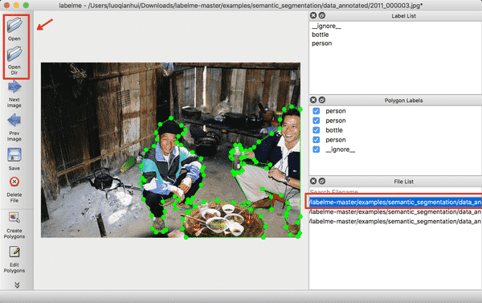
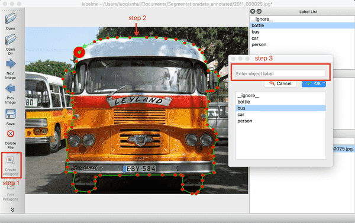
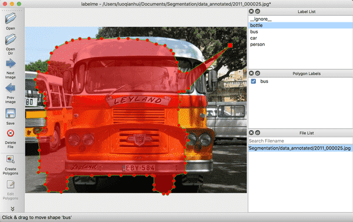
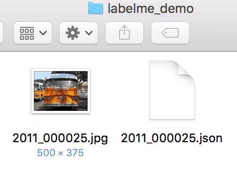
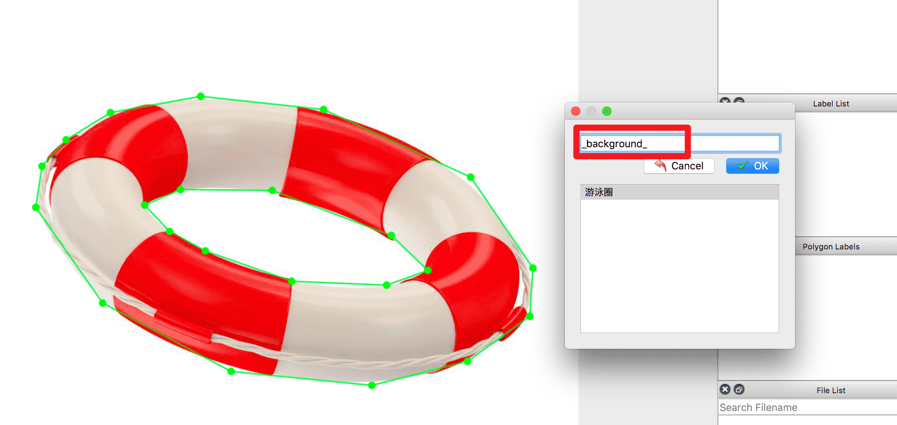
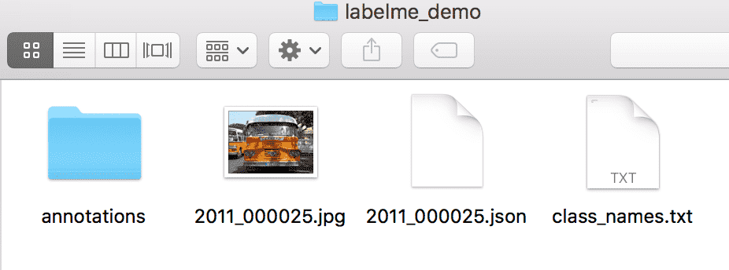

English|[简体中文](transform_cn.md)
# LabelMe Annotating Tutorial

Whether it is semantic segmentation, panoramic segmentation, or instance segmentation, we all need sufficient training data.

In this tutorial, we introduce the usage of LabelMe and convert the labeled image to the required format by PaddleSeg.

## 1. Installation

LabelMe supports the use of Windows/macOS/Linux three systems, and the label format under the three systems is the same.

For the specific installation process, please refer to the [Official Installation Guide](https://github.com/wkentaro/labelme).

## 2. Using

### Preview annotated Images

Open the terminal and enter `labelme`, and an interactive interface of LabelMe will appear.

You can preview the marked image given by `LabelMe` before starting to label the custom dataset.

<div align="center">
  
<p>Figure 1 : Schematic diagram of LableMe interactive interface</p>
</div>


Click `OpenDir` to open `<path/to/labelme>/examples/semantic_segmentation/data_annotated`, where `<path/to/labelme>` is the cloned `labelme` After opening, it shows the truth label of semantic segmentation.

<div align="center">
  
<p>Figure 2 : Schematic diagram of annotated images</p>
</div>


### Start Annotating

Please follow the steps below to label the dataset:

(1) Click `OpenDir` to open the directory where the picture to be labeled is located, click `Create Polygons`, draw polygons along the edges of the target, and enter the target category after completion. During the marking process, if a point is drawn wrong, you can press the undo shortcut key to undo the point. The undo shortcut key under Mac is `command+Z`.

<div align="center">
  
<p>Figure 3 : Schematic diagram of marking a single target</p>
</div>


(2) Right-click and select `Edit Polygons` to move the position of the polygon as a whole or to move a certain point; right-click and select `Edit Label` to modify the category of each target. Please perform this step according to your own needs, if you don't need to modify it, you can skip it.

<div align="center">
  
<p>Figure 4 : Schematic diagram of modified annotation</p>
</div>


(3) After marking all targets in the picture, click `Save` to save the json file, **please put the json file and the picture in the same folder**, and click `Next Image` to mark the next picture.

The truth value files produced by LableMe can refer to the [folder] (https://github.com/PaddlePaddle/PaddleSeg/blob/release/v0.8.0/docs/annotation/labelme_demo) given by us.

<div align="center">
  
<p>Figure 5 : Schematic diagram of the truth file produced by LableMe</p>
</div>

**Note：**

Marking method for targets with holes in the middle: After marking the target outline, draw a polygon along the edge of the hole area and assign it to another category, and if it is a background, assign it to `_background_`. as follows:

<div align="center">
  
<p>Figure 6 : Schematic diagram of labeling with holes in the target</p>
</div>


## 3. Data format conversion

Finally, use the data conversion script to convert the data to the format required by PaddleSeg.

Run the following code to convert the annotated data. `<PATH/TO/LABEL_JSON_FILE>` is the directory of the folder where the picture and the json file produced by LabelMe are located, and it is also the directory of the folder where the converted label set is located.
```
python tools/data/labelme2seg.py <PATH/TO/LABEL_JSON_FILE>
```

The dataset directory structure after data format conversion is as follows:

```
my_dataset                 # Root directory
|-- annotations            # Ground-truth
|   |-- xxx.png            # Pixel-level truth information
|   |...
|-- class_names.txt        # The category name of the dataset
|-- xxx.jpg(png or other)  # Original image of dataset
|-- ...
|-- xxx.json               # Json file,used to save annotation information
|-- ...

```

<div align="center">
  
<p>Figure 7 : Schematic diagram of the structure of the dataset catalog after format conversion</p>
</div>
