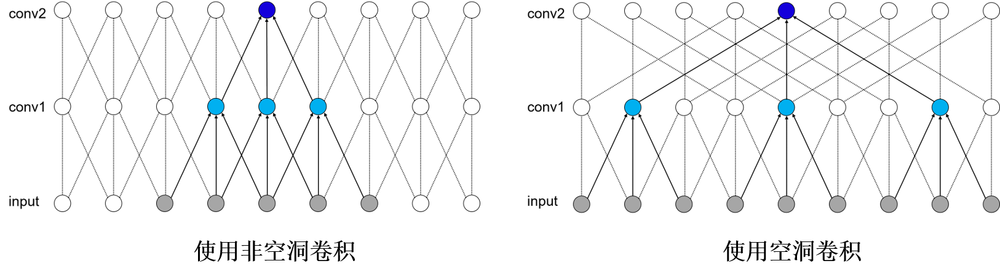
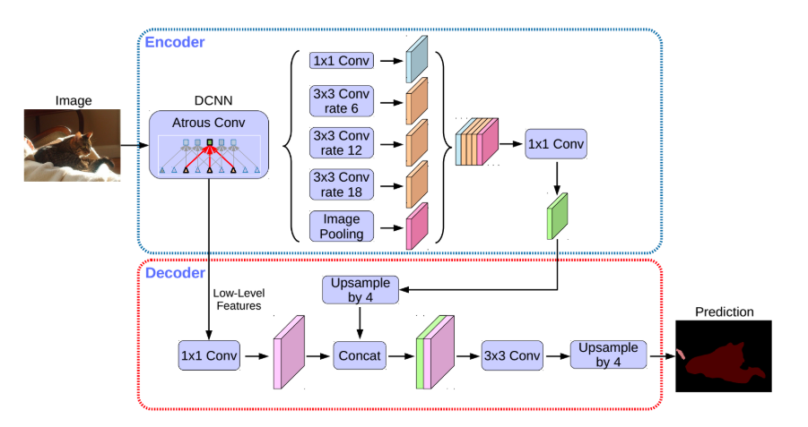

# DeepLab V3+
### **基本原理**

对于当前十分流行的实时分割场景，例如短视频领域、直播领域，都需要实时分割算法，这就需要我们的算法足够轻量。那么一个好的分割模型网络是什么样子的呢？ 首先我们来看下常见的分割网络是什么样的结构。 一个分割网络的输出是一个$N\times H\times W$的概率图，其中N是一个向量，向量的维数表示为类别的数量，也就是说向量的每个元素对应一个类别，而这个元素的数值是概率值，表示为对应该类别的概率。因为要给出每一个像素类别，所以$H\times W$大小需要与原图保持一致。分割网络可以看作是一个没有全连接层的全卷积网络，常见的网络结构可以分为Encoder和Decoder两个部分：

- Encoder部分特征图的长宽会逐步缩小，也就是需要下采样。
- Decoder部分特征图的长宽会逐步增大，也就是需要上采样。

一个好的分割网络需要解决哪些问题？第一个问题就是如何通过较少Encoder层数来获得较大的感受野。首先来看下什么是感受野。输出特征图上每个点的数值，是由输入图片上大小为$k_h\times k_w$的区域的元素与卷积核每个元素相乘再相加得到的，所以输入图像上$k_h\times k_w$区域内每个元素数值的改变，都会影响输出点的像素值。我们将这个区域叫做输出特征图上对应点的感受野。感受野内每个像素数值的变动，都会影响输出点的数值变化。因此感受野也可以表示为特征图上每个点所受图像区域范围影响的大小。感受野的大小是分割网络的特征表示能力的一个重要评价指标，因为我们希望尽可能提高感受野的大小。最直接的方法就是提高Encoder网络的层数，但是这种方法会在扩大感受野的同时，带来一些弊端，例如增加了网络参数规模，导致训练耗时增加。那么有没有更好的方法呢？

通过扩大卷积核可触达的区域来增大感受野，扩大卷积所包含的信息范围。如下图所示，该图为空洞卷积作用的示意图示意图。可以看到未使用空洞卷积的网络，一个输出的深蓝色的点可以覆盖5个输入像素点。在使用空洞卷积之后，一个输出点可以覆盖9个输入像素的点。其具体应用示例可以参见DeepLabv3+的网络结构。

分割网络需要面临的第二个问题是下采样过程中特征的长和宽在不断减少，我们虽然得到了高阶特征，但是维度较小，如果直接作为上采样输入，则有可能丢失一部分信息，怎么解决这个问题呢？这时可以使用跳跃连接功能。通过跳跃连接，使上采样过程不仅使用高阶特征，也可以使用同维度的低阶特征，具体使用示例可以参见基本原理中的U-Net模型介绍。

除了上述两个问题之外，分割网络还需要解决多尺度问题，多尺度问题是指同一个图片中目标有大有小，如何保证不同尺度的目标均能被很好的处理呢？这里可以使用ASPP网络结构，通俗的讲，其实现思想是让不同尺度的目标交给不同感受野的卷积层来处理，大感受野处理大目标，小感受野处理小目标。其具体应用示例可以参见下面DeepLabv3+的网络结构。

### DeepLabv3+

DeepLabv3+是DeepLab系列的最后一篇文章，其前作有DeepLabv1、DeepLabv2和DeepLabv3。在最新作中，作者结合编码器-解码器(encoder-decoder)结构和空间金字塔池化模块(Spatial Pyramid Pooling, SPP)的优点提出新的语义分割网络DeepLabv3+，在 PASCAL VOC 2012和Cityscapes数据集上取得新的state-of-art performance.
其整体结构如下所示，Encoder的主体是带有空洞卷积(Atrous Convolution)的骨干网络，骨干网络可采用ResNet等常用的分类网络，作者使用了改进的Xception模型作为骨干网络。紧跟其后的空洞空间金字塔池化模块(Atrous Spatial Pyramid Pooling, ASPP)则引入了多尺度信息。相比前作DeepLabv3，DeepLabv3+加入decoder模块，将浅层特征和深层特征进一步融合，优化分割效果，尤其是目标边缘的效果。此外，作者将深度可分离卷积(Depthwise Separable Convolution)应用到ASPP和Decoder模块，提高了语义分割的健壮性和运行速率。

DeepLabv3+结构图

具体原理细节请参考[Encoder-Decoder with Atrous Separable Convolution for Semantic Image Segmentation](https://arxiv.org/abs/1802.02611)。
