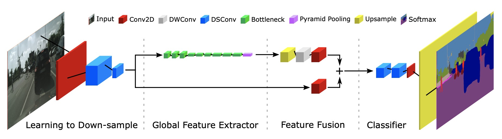

### Fast-SCNN

Fast-SCNN 是一个面向实时的语义分割网络。在双分支的结构基础上，大量使用了深度可分离卷积和逆残差（inverted-residual）模块，并且使用特征融合构造金字塔池化模块 (Pyramid Pooling Module)来融合上下文信息。这使得Fast-SCNN在保持高效的情况下能学习到丰富的细节信息。Fast-SCNN最大的特点是“小快灵”，即该模型在推理计算时仅需要较小的FLOPs，就可以快速推理出一个不错的结果。整个网络结构如下：

Fast-SCNN结构图

具体原理细节请参考[Fast-SCNN: Fast Semantic Segmentation Network](https://arxiv.org/abs/1902.04502)
