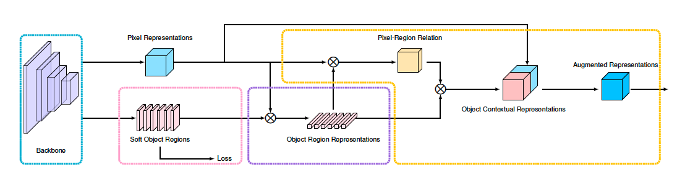

### OCRNet

FCN (Fully Convolutional Network for Semantic Segmentation) can classify images at the pixel level and solve the problem of image segmentation at the semantic level, so most of the existing semantic segmentation methods are based on FCN. However, these methods also have certain drawbacks, such as low resolution, lack of contextual information, and boundary errors. In 2020, related scholars constructively proposed OCRNet, a network framework based on Object Contextual Representation (OCR), in order to solve the problem of lack of contextual information in semantic segmentation. Its overall structure is shown below. Implementing this OCR method needs to go through three stages—first forming Soft Object Regions, then calculating Object Region Representations, and finally obtaining object contextual feature representation and contextual information-enhanced feature representation (Augmented Representation) . Compared with other semantic segmentation methods, the OCR method is more efficient and accurate. Because the OCR method solves the object region classification problem, not the pixel classification problem, that is, the OCR method can effectively and explicitly enhance the object information. In terms of performance and complexity, OCRNet is also better. In 2020, the "HRNet + OCR + SegFix" version won the first place in 2020ECCV Cityscapes.

OCRNet

For details, please refer to[Object-Contextual Representations for SemanticSegmentation](https://arxiv.org/pdf/1909.11065.pdf).
