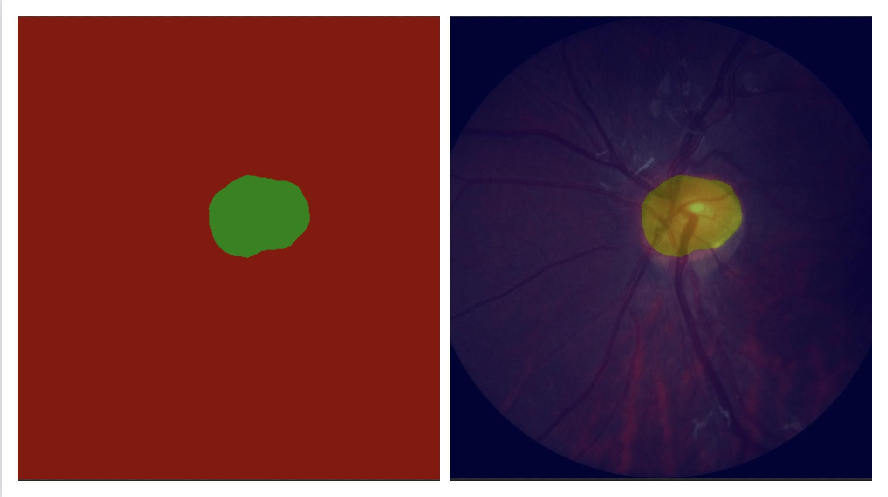
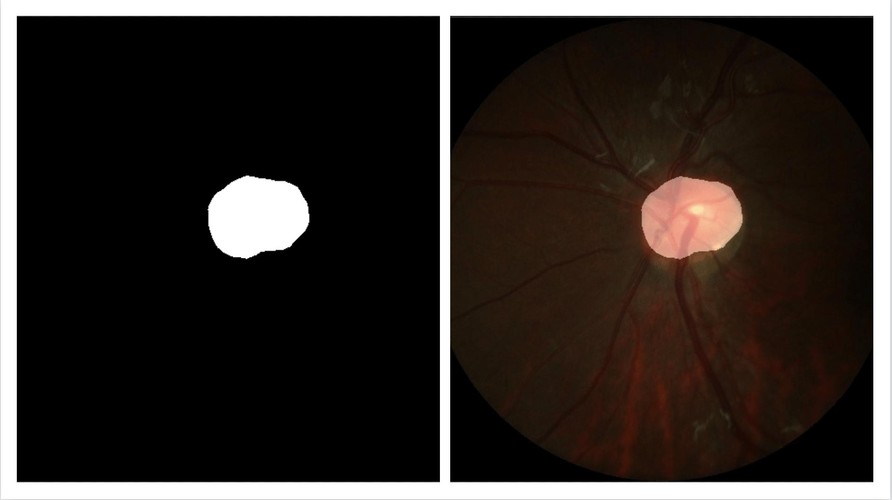

简体中文 | [English](predict.md)
# 预测

除了分析模型的IOU、ACC和Kappa指标之外，我们还可以查阅一些具体样本的切割样本效果，从Bad Case启发进一步优化的思路。

## 预测用法

`tools/predict.py`脚本是专门用来可视化预测的，命令格式如下所示。

```
python tools/predict.py \
       --config configs/quick_start/pp_liteseg_optic_disc_512x512_1k.yml \
       --model_path output/iter_1000/model.pdparams \
       --image_path dataset/optic_disc_seg/JPEGImages/H0003.jpg \
       --save_dir output/result
```

其中`image_path`可以是一张图片的路径，也可以是一个包含图片路径的文件列表，也可以是一个目录，这时候将对该图片或文件列表或目录内的所有图片进行预测并保存可视化结果图。

同样的，可以通过`--aug_pred`开启多尺度翻转预测， `--is_slide`开启滑窗预测。


在执行预测时，如果只有原始图像，`tools/predict.py`脚本的输入参数`--image_path`可以设置为保存所有原始图像的目录，也可以设置为txt文件的路径（符合如下格式，只有原始图像）。
```
images/image1.jpg
images/image2.jpg
...
```

如果`tools/predict.py`脚本的输入参数`--image_path`设置为txt文件的路径（如下格式，包含原始图像和标注图像），测试脚本将自动忽略文件列表中给出的标注图像。
```
images/image1.jpg labels/label1.png
images/image2.jpg labels/label2.png
...
```


## 预测函数解析

预测API的参数解析

```
paddleseg.core.predict(
                    model,
                    model_path,
                    transforms,
                    image_list,
                    image_dir=None,
                    save_dir='output',
                    aug_pred=False,
                    scales=1.0,
                    flip_horizontal=True,
                    flip_vertical=False,
                    is_slide=False,
                    stride=None,
                    crop_size=None,
                    custom_color=None
)
```

**参数说明如下**

| 参数名          | 数据类型          | 用途                                                 | 是否必选项 | 默认值   |
| --------------- | ----------------- | ---------------------------------------------------- | ---------- | -------- |
| model           | nn.Layer          | 分割模型                                             | 是         | -        |
| model_path      | str               | 训练最优模型的路径                                   | 是         | -        |
| transforms      | transform.Compose | 对输入图像进行预处理                                 | 是         | -        |
| image_list      | list              | 待预测的图像路径列表                                 | 是         | -        |
| image_dir       | str               | 待要预测的图像路径目录                               | 否         | None     |
| save_dir        | str               | 结果输出路径                                         | 否         | 'output' |
| aug_pred        | bool              | 是否使用多尺度和翻转增广进行预测                     | 否         | False    |
| scales          | list/float        | 设置缩放因子，`aug_pred`为True时生效                   | 否         | 1.0      |
| flip_horizontal | bool              | 是否使用水平翻转，`aug_pred`为True时生效           | 否         | True     |
| flip_vertical   | bool              | 是否使用垂直翻转，`aug_pred`为True时生效           | 否         | False    |
| is_slide        | bool              | 是否通过滑动窗口进行评估                             | 否         | False    |
| stride          | tuple/list        | 设置滑动窗宽的宽度和高度，`is_slide`为True时生效       | 否         | None     |
| crop_size       | tuple/list        | 设置滑动窗口的裁剪的宽度和高度，`is_slide`为True时生效 | 否         | None     |
| custom_color    | list              | 设置自定义分割预测颜色，len(custom_color) = 3 * 像素种类  | 否        | 预设color map |

导入API接口，开始预测。

```
from paddleseg.core import predict
predict(
        model,
        model_path='output/best_model/model.pdparams',# 模型路径
        transforms=transforms, #transform.Compose， 对输入图像进行预处理
        image_list=image_list, #list,待预测的图像路径列表。
        image_dir=image_dir, #str，待预测的图片所在目录
        save_dir='output/results' #str，结果输出路径
    )
```

## 输出文件说明

如果你不指定输出位置，在默认文件夹`output/results`下将生成两个文件夹`added_prediction`与`pseudo_color_prediction`, 分别存放叠加效果图与预测mask的结果。

```
output/result
|
|--added_prediction
|  |--image1.jpg
|  |--image2.jpg
|  |--...
|
|--pseudo_color_prediction
|  |--image1.jpg
|  |--image2.jpg
|  |--...
```


## 自定义color map

经过预测后，我们得到的是默认color map配色的预测分割结果。

以视盘分割为例，伪彩色标注图/叠加图如下：



在该分割结果中，前景以红色标明，背景以黑色标明。如果你想要使用其他颜色，可以参考如下命令：
```python
python tools/predict.py \
       --config configs/quick_start/pp_liteseg_optic_disc_512x512_1k.yml \
       --model_path output/iter_1000/model.pdparams \
       --image_path data/optic_disc_seg/JPEGImages/H0003.jpg \
       --save_dir output/result \
       --custom_color 0 0 0 255 255 255
```
分割预测结果如下：



参数解析：
- 可以看到我们在最后添加了 `--custom_color 0 0 0 255 255 255`，这是什么意思呢？在RGB图像中，每个像素最终呈现出来的颜色是由RGB三个通道的分量共同决定的，因此该命令行参数后每三位代表一种像素的颜色，位置与`label.txt`中各类像素点一一对应。
- 如果使用自定义color map，输入的`color值`的个数应该等于`3 * 像素种类`（取决于你所使用的数据集）。比如，你的数据集有 3 种像素，则可考虑执行:
```python
python tools/predict.py \
       --config configs/quick_start/pp_liteseg_optic_disc_512x512_1k.yml \
       --model_path output/iter_1000/model.pdparams \
       --image_path data/optic_disc_seg/JPEGImages/H0003.jpg \
       --save_dir output/result \
       --custom_color 0 0 0 100 100 100 200 200 200
```

我们建议你参照RGB颜色数值对照表来设置`--custom_color`。
