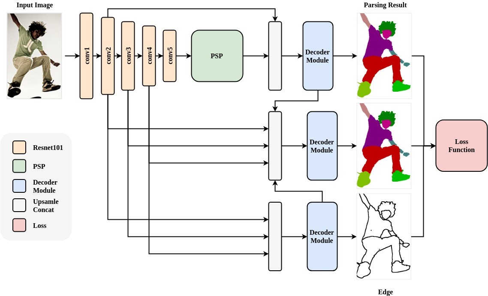
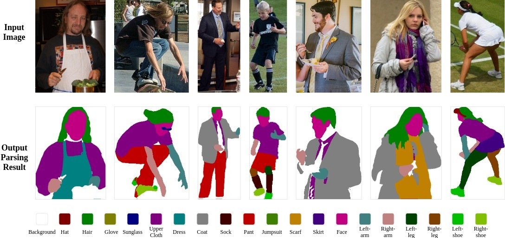

# Augmented Context Embedding with Edge Perceiving(ACE2P)

## 模型概述
人体解析(Human Parsing)是细粒度的语义分割任务，旨在识别像素级别的人类图像的组成部分（例如，身体部位和服装）。Augmented Context Embedding with Edge Perceiving (ACE2P)通过融合底层特征、全局上下文信息和边缘细节，端到端训练学习人体解析任务。以ACE2P单人人体解析网络为基础的解决方案在CVPR2019第三届Look into Person (LIP)挑战赛中赢得了全部三个人体解析任务的第一名。

## 模型框架图


## 模型细节
ACE2P模型包含三个分支:
* 语义分割分支
* 边缘检测分支
* 融合分支

语义分割分支采用resnet101作为backbone,通过Pyramid Scene Parsing Network融合上下文信息以获得更加精确的特征表征

边缘检测分支采用backbone的中间层特征作为输入，预测二值边缘信息

融合分支将语义分割分支以及边缘检测分支的特征进行融合，以获得边缘细节更加准确的分割图像。

分割问题一般采用mIoU作为评价指标，特别引入了IoU loss结合cross-entropy loss以针对性优化这一指标

测试阶段，采用多尺度以及水平翻转的结果进行融合生成最终预测结果

训练阶段，采用余弦退火的学习率策略， 并且在学习初始阶段采用线性warm up

数据预处理方面，保持图片比例并进行随机缩放，随机旋转，水平翻转作为数据增强策略

## LIP指标

该模型在测试尺度为'377,377,473,473,567,567'且水平翻转的情况下，meanIoU为62.63

多模型ensemble后meanIoU为65.18, 居LIP Single-Person Human Parsing Track榜单第一


## 模型预测效果展示



人体解析(Human Parsing)是细粒度的语义分割任务，旨在识别像素级别的人类图像的组成部分（例如，身体部位和服装）。本章节使用冠军模型Augmented Context Embedding with Edge Perceiving (ACE2P)进行预测分割。

## 代码使用说明

### 1. 模型下载

执行以下命令下载并解压ACE2P预测模型：

```
python download_ACE2P.py
```

或点击[链接](https://paddleseg.bj.bcebos.com/models/ACE2P.tgz)进行手动下载, 并在contrib/ACE2P下解压。

### 2. 数据下载

测试图片共10000张，
点击 [Baidu_Drive](https://pan.baidu.com/s/1nvqmZBN#list/path=%2Fsharelink2787269280-523292635003760%2FLIP%2FLIP&parentPath=%2Fsharelink2787269280-523292635003760)
下载Testing_images.zip，或前往LIP数据集官网进行下载。
下载后解压到./data文件夹下


### 3. 快速预测

使用GPU预测
```
python -u infer.py --example ACE2P --use_gpu
```

使用CPU预测：
```
python -u infer.py --example ACE2P
```

**NOTE:** 运行该模型需要2G左右显存。由于数据图片较多，预测过程将比较耗时。

#### 4. 预测结果示例：

  原图：

  

  预测结果：

  

### 备注

1. 数据及模型路径等详细配置见ACE2P/HumanSeg/RoadLine下的config.py文件
2. ACE2P模型需预留2G显存，若显存超可调小FLAGS_fraction_of_gpu_memory_to_use

## 引用

**论文**

*Devil in the Details: Towards Accurate Single and Multiple Human Parsing* https://arxiv.org/abs/1809.05996

**代码**

https://github.com/Microsoft/human-pose-estimation.pytorch

https://github.com/liutinglt/CE2P
