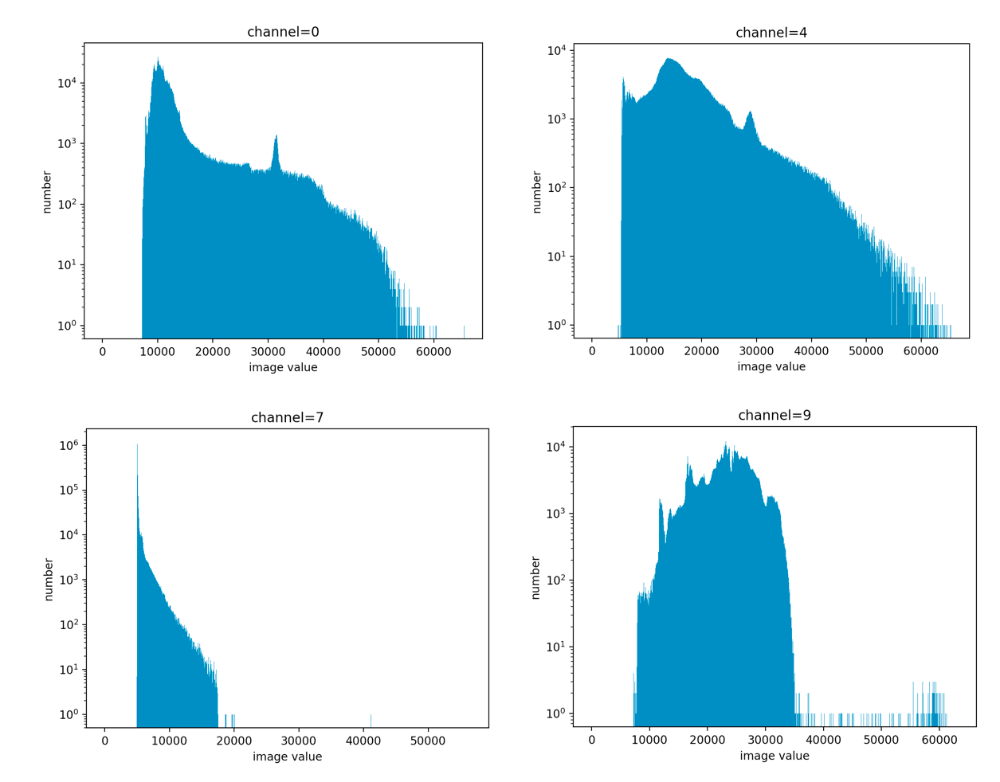

# 数据校验和分析
为确保能正常训练，我们应该先对数据集进行校验。同时，遥感影像往往由许多波段组成，不同波段数据分布可能大相径庭，例如可见光波段和热红外波段分布十分不同。为了更深入了解数据的组成、优化模型训练效果，需要对数据进行分析。
接下来以`remote_sensing_seg`数据集为例展示数据校验和分析的全过程。

## Step1 数据校验和初步分析

我们提供数据校验和分析的脚本，帮助您排查基本的数据问题，为如何配置训练参数提供指导。使用方式如下所示：
```shell script
python tools/data_analyse_and_check.py --data_dir 'dataset/remote_sensing_seg/' --num_classes 5
```
参数说明：
- --data_dir: 数据集所在目录
- --num_classes: 数据的类别数

运行后，命令行将显示概览信息，详细的错误信息将以data_analyse_and_check.log文件保存到数据集所在目录。

### 数据校验
数据校验内容如下：
#### 1 列表分割符校验（separator_check）
检查在`train.txt`，`val.txt`和`test.txt`列表文件中的分隔符设置是否正确。

#### 2 数据读取校验（imread_check）
检查是否能成功读取`train.txt`，`val.txt`，`test.txt`中所有图片。

若不正确返回错误信息。错误可能有多种情况，如数据集路径设置错误、图片损坏等。

#### 3 标注通道数校验（single_channel_label_check）
检查标注图的通道数。正确的标注图应该为单通道图像。

#### 4 标注类别校验（label_class_check）
检查实际标注类别是否和配置参数`num_classes`，`ignore_index`匹配。

**NOTE:**
标注图像类别数值必须在[0~(`num_classes`-1)]范围内或者为`ignore_index`。
标注类别最好从0开始，否则可能影响精度。

#### 5 图像与标注图尺寸一致性校验（shape_check）
验证图像尺寸和对应标注图尺寸是否一致。


### 数据分析
数据统计分析内容如下：

#### 1 标注类别统计（label_class_statistics）
统计每种类别的像素总数和所占比例。统计结果示例如下：
```
Label class statistics:
(label class, percentage, total pixel number) = [(0, 0.1372, 2194601), (1, 0.0827, 1322459), (2, 0.0179, 286548), (3, 0.1067, 1706810), (4, 0.6556, 10489582)]
```

#### 2 图像尺寸范围统计（img_shape_range_statistics）
统计数据集中图片的最大和最小的宽高。

#### 3 图像通道数统计（img_channels_statistics）
统计数据集中图片的通道个数。

#### 4 数据范围统计（data_range_statistics）
逐通道地统计数据集的数值范围。

#### 5 数据分布统计（data_distribution_statistics）
逐通道地统计数据集分布。并将分布保存为`pkl`文件，方便后续可视化和数据裁剪。

#### 6 归一化系数计算（cal_normalize_coefficient）
逐通道地计算归一化系数mean、standard deviation.

**备注：** 数据分析步骤1\~3在训练集、验证集、测试集上分别进行，步骤4\~6在整个数据集上进行。

## Step2 数据分布可视化，确定数据裁剪范围
### 数据分布可视化
我们提供可视化数据分布脚本，对数据集的数据分布按通道进行可视化。  
可视化需要先安装matplotlib:
```shell script
pip install matplotlib
```
使用方式如下：
```shell script
python tools/data_distribution_vis.py --pkl_path 'dataset/remote_sensing_seg/img_pixel_statistics.pkl'
```
参数说明：
- --pkl_path: 数据分布文件保存路径

其中部分通道的可视化效果如下：

需要注意的是，为便于观察，纵坐标为对数坐标。

### 确定数据裁剪范围
遥感影像数据分布范围广，其中往往存在一些异常值，影响算法对实际数据分布的拟合效果。为更好地对数据进行归一化，需要抑制遥感影像中少量的异常值。  
我们可以根据上述的数据分布统计结果来确定数据裁剪范围，并在后续图像预处理过程中对超出范围的像素值通过截断进行校正，从而去除异常值带来的干扰。

例如对于上述数据分布进行逐通道数据裁剪，我们选取的截断范围是：
```
裁剪范围最小值： clip_min_value = [7172,  6561,  5777, 5103, 4291, 4000, 4000, 4232, 6934, 7199]
裁剪范围最大值： clip_max_value = [50000, 50000, 50000, 50000, 50000, 40000, 30000, 18000, 40000, 36000]
```

## Step3 统计裁剪比例、归一化系数
为避免数据裁剪范围选取不当带来的影响，应该统计异常值像素占比，确保受影响的像素比例不要过高。
接着对裁剪后的数据计算归一化系数mean和standard deviation，用于图像预处理中的归一化参数设置。

使用方式如下：
```shell script
python tools/cal_norm_coef.py --data_dir 'dataset/remote_sensing_seg/' \
--pkl_path 'dataset/remote_sensing_seg/img_pixel_statistics.pkl' \
--clip_min_value 7172 6561 5777 5103 4291 4000 4000 4232 6934 7199 \
--clip_max_value 50000 50000 50000 50000 50000 40000 30000 18000 40000 36000
```
参数说明：
- --data_dir: 数据集路径
- --pkl_path: 数据分布文件保存路径
- --clip_min_value: 数据裁剪范围最小值
- --clip_max_value: 数据裁剪范围最大值

裁剪像素占比统计结果如下：
```
channel 0, the percentage of pixels to be clipped = 0.0005625999999999687
channel 1, the percentage of pixels to be clipped = 0.0011332250000000155
channel 2, the percentage of pixels to be clipped = 0.0008772375000000165
channel 3, the percentage of pixels to be clipped = 0.0013191750000000058
channel 4, the percentage of pixels to be clipped = 0.0012433250000000173
channel 5, the percentage of pixels to be clipped = 7.49875000000122e-05
channel 6, the percentage of pixels to be clipped = 0.0006973750000000001
channel 7, the percentage of pixels to be clipped = 4.950000000003563e-06
channel 8, the percentage of pixels to be clipped = 0.00014873749999999575
channel 9, the percentage of pixels to be clipped = 0.00011173750000004201
```
可看出，被裁剪像素占比均不超过0.2%

裁剪后数据的归一化系数如下：
```
Count the channel-by-channel mean and std of the image:
mean = [0.14311189 0.14288498 0.14812998 0.16377212 0.27375384 0.27409344 0.27749602 0.07767443 0.56946994 0.55497161]
std = [0.09101633 0.09600706 0.09619362 0.10371447 0.10911952 0.11043593 0.12648043 0.02774626 0.06822348 0.06237759]
```
