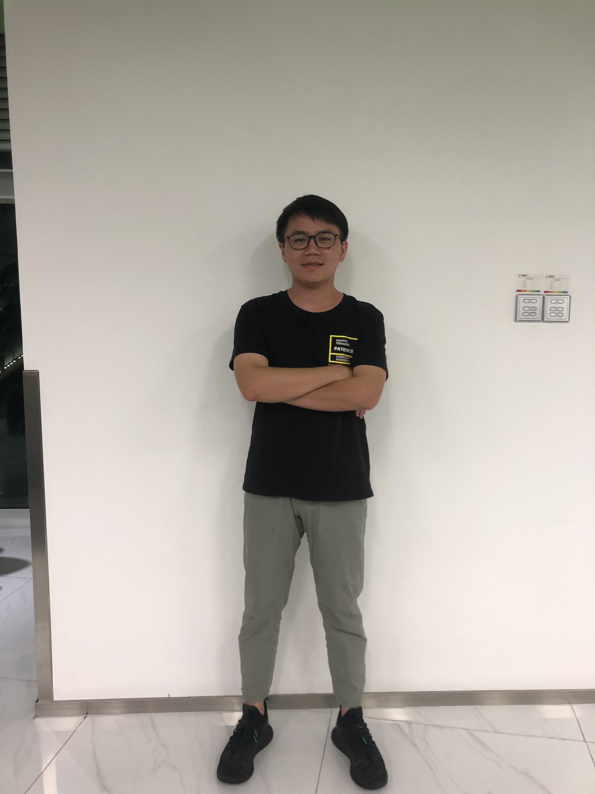

# PaddleSeg 预测部署方案


[1.说明](#1说明)

[2.主要目录和文件](#2主要目录和文件)

[3.编译](#3编译)

[4.预测并可视化结果](#4预测并可视化结果)

## 1.说明

本目录提供一个跨平台`PaddlePaddle`图像分割模型的`C++`预测部署方案，用户通过一定的配置，加上少量的代码，即可把模型集成到自己的服务中，完成图像分割的任务。

主要设计的目标包括以下四点：
- 跨平台，支持在 windows 和 Linux 完成编译、开发和部署
- 支持主流图像分割任务，用户通过少量配置即可加载模型完成常见预测任务，比如人像分割等
- 可扩展性，支持用户针对新模型开发自己特殊的数据预处理、后处理等逻辑
- 高性能，除了`PaddlePaddle`自身带来的性能优势，我们还针对图像分割的特点对关键步骤进行了性能优化

**注意** 如需要使用`Python`的预测部署方法，请参考：[Python预测部署](../python/)


## 2.主要目录和文件

```
cpp
├── demo.cpp # 演示加载模型、读入数据、完成预测任务C++代码
|
├── conf
│   └── humanseg.yaml # 示例人像分割模型配置
├── images
│   └── humanseg # 示例人像分割模型测试图片目录
├── tools
│   └── visualize.py # 示例分割模型结果可视化脚本
├── docs
|   ├── linux_build.md # Linux 编译指南
|   ├── windows_vs2015_build.md # windows VS2015编译指南
│   └── windows_vs2019_build.md # Windows VS2019编译指南
|
├── utils # 一些基础公共函数
|
├── preprocess # 数据预处理相关代码
|
├── predictor # 模型加载和预测相关代码
|
├── CMakeList.txt # cmake编译入口文件
|
└── external-cmake # 依赖的外部项目cmake（目前仅有yaml-cpp）

```

## 3.编译
支持在`Windows`和`Linux`平台编译和使用：
- [Linux 编译指南](./docs/linux_build.md)
- [Windows 使用 Visual Studio 2019 Community 编译指南](./docs/windows_vs2019_build.md)
- [Windows 使用 Visual Studio 2015 编译指南](./docs/windows_vs2015_build.md)

`Windows`上推荐使用最新的`Visual Studio 2019 Community`直接编译`CMake`项目。

## 4.预测并可视化结果

完成编译后，便生成了需要的可执行文件和链接库，然后执行以下步骤：

### 4.1. 下载模型文件
我们提供了一个人像分割模型示例用于测试，点击右侧地址下载：[示例模型下载地址](https://paddleseg.bj.bcebos.com/inference_model/deeplabv3p_xception65_humanseg.tgz)

下载并解压，解压后目录结构如下：
```
deeplabv3p_xception65_humanseg
├── __model__ # 模型文件
|
└── __params__ # 参数文件
```
解压后把上述目录拷贝到合适的路径：

**假设**`Windows`系统上，我们模型和参数文件所在路径为`D:\projects\models\deeplabv3p_xception65_humanseg`。

**假设**`Linux`上对应的路径则为`/root/projects/models/deeplabv3p_xception65_humanseg`。


### 4.2. 修改配置

基于`PaddleSeg`训练的模型导出时，会自动生成对应的预测模型配置文件，请参考文档：[模型导出](../../docs/model_export.md)。

`inference`源代码(即本目录)的`conf`目录下提供了示例人像分割模型的配置文件`humanseg.yaml`, 相关的字段含义和说明如下：

```yaml
DEPLOY:
    # 是否使用GPU预测
    USE_GPU: 1
    # 是否是PaddleSeg 0.3.0新版本模型
    USE_PR : 1
    # 模型和参数文件所在目录路径
    MODEL_PATH: "/root/projects/models/deeplabv3p_xception65_humanseg"
    # 模型文件名
    MODEL_FILENAME: "__model__"
    # 参数文件名
    PARAMS_FILENAME: "__params__"
    # 预测图片的的标准输入尺寸，输入尺寸不一致会做resize
    EVAL_CROP_SIZE: (513, 513)
    # 均值
    MEAN: [0.40787450980392154, 0.4575254901960784, 0.481078431372549]
    # 方差
    STD: [0.00392156862745098, 0.00392156862745098, 0.00392156862745098]
    # 图片类型, rgb 或者 rgba
    IMAGE_TYPE: "rgb"
    # 分类类型数
    NUM_CLASSES: 2
    # 图片通道数
    CHANNELS : 3
    # 预处理方式，目前提供图像分割的通用处理类SegPreProcessor
    PRE_PROCESSOR: "SegPreProcessor"
    # 预测模式，支持 NATIVE 和 ANALYSIS
    PREDICTOR_MODE: "ANALYSIS"
    # 每次预测的 batch_size
    BATCH_SIZE : 3
```
修改字段`MODEL_PATH`的值为你在**上一步**下载并解压的模型文件所放置的目录即可。

**注意**在使用CPU版本预测库时，`USE_GPU`的值必须设为0，否则无法正常预测。

### 4.3. 执行预测

在终端中切换到生成的可执行文件所在目录为当前目录(Windows系统为`cmd`)。

`Linux` 系统中执行以下命令：
```shell
./demo --conf=/root/projects/PaddleSeg/deploy/cpp/conf/humanseg.yaml --input_dir=/root/projects/PaddleSeg/deploy/cpp/images/humanseg/
```
`Windows` 中执行以下命令:
```shell
D:\projects\PaddleSeg\deploy\cpp\build\Release>demo.exe --conf=D:\\projects\\PaddleSeg\\deploy\\cpp\\conf\\humanseg.yaml --input_dir=D:\\projects\\PaddleSeg\\deploy\\cpp\\images\humanseg\\
```


预测使用的两个命令参数说明如下：

| 参数 | 含义 |
|-------|----------|
| conf | 模型配置的Yaml文件路径 |
| input_dir | 需要预测的图片目录 |


配置文件说明请参考上一步，样例程序会扫描input_dir目录下的所有以**jpg或jpeg**为后缀的图片，并生成对应的预测结果（若input_dir目录下没有以**jpg或jpeg**为后缀的图片，程序会报错）。图像分割会对`demo.jpg`的每个像素进行分类，其预测的结果保存在`demo_jpg_mask.png`中。分割预测结果的图不能直接看到效果，必须经过可视化处理。对于二分类的图像分割模型。如果需要对预测结果进行**可视化**，请参考[可视化脚本使用方法](./docs/vis.md)。

输入原图  


输出预测结果  

