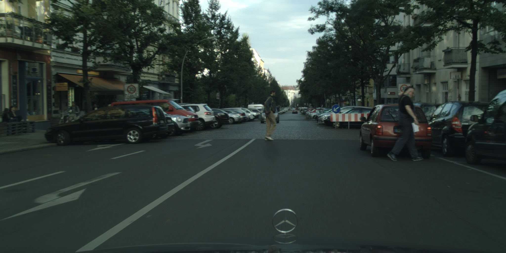
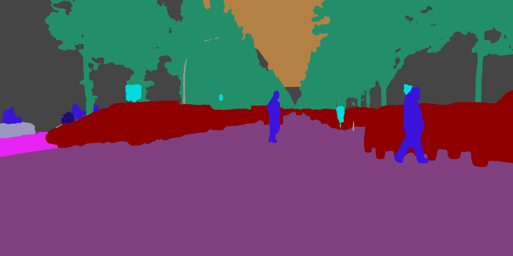

# 图像分割结果可视化说明

本文档介绍如何使用可视化脚本对图像分割结果进行可视化处理。**注意：可视化脚本处理仅针对PaddleSeg C++预测部署方案生成的预测结果。**

## 说明
图像分割模型会对预测的图像的每个像素进行分类，所以图像分割模型的预测结果是图像里每个像素的标签，我们将预测结果以图片格式保存。例如预测图片`demo.jpg`，其预测的结果以图片格式保存在`demo_jpg.png`中。保存分割预测结果的图片并不能直接看到效果（一张全黑的图），必须经过可视化处理。以下为使用方法。

```bash
# 假设当前路径为PaddleSeg根目录
# 切换到脚本所在目录
cd inference/tools/
# 拷贝保存分割预测结果的图片到本目录
cp XXX/demo_jpg.png .
# 运行可视化脚本
python visualize.py demo.jpg demo_jpg_mask.png vis_result.png
```

以下为上述运行可视化脚本例子中每个参数的含义，请根据测试机器中图片的**实际路径**修改对应参数。

| 参数 | 含义 |
|-------|----------|
| demo.jpg | 原图路径 |
| demo_jpg.png | 保存预测结果的图片的路径 |
| vis_result.png| 可视化后的效果图路径|


**可视化结果展示：**

以下以cityscape模型的预测结果进行展示。

原图(`demo.jpg`):


预测结果图(`demo_jpg.png`, 仅用来保存预测的结果，需经过可视化处理):


效果图(`vis_result.png`)：

