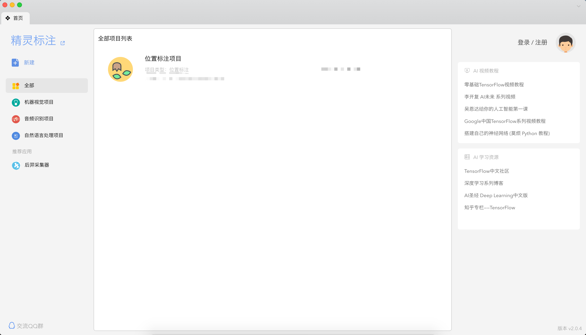
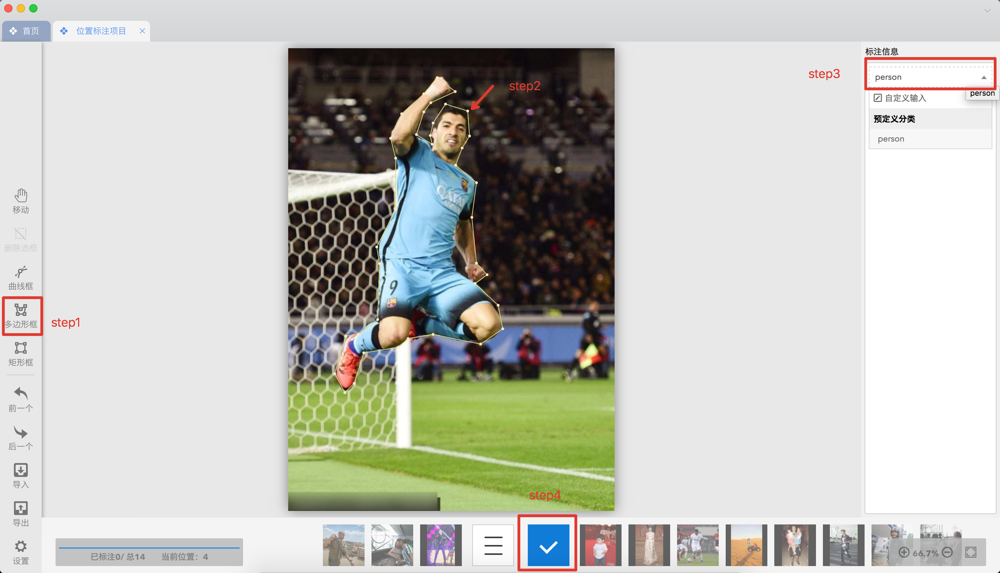
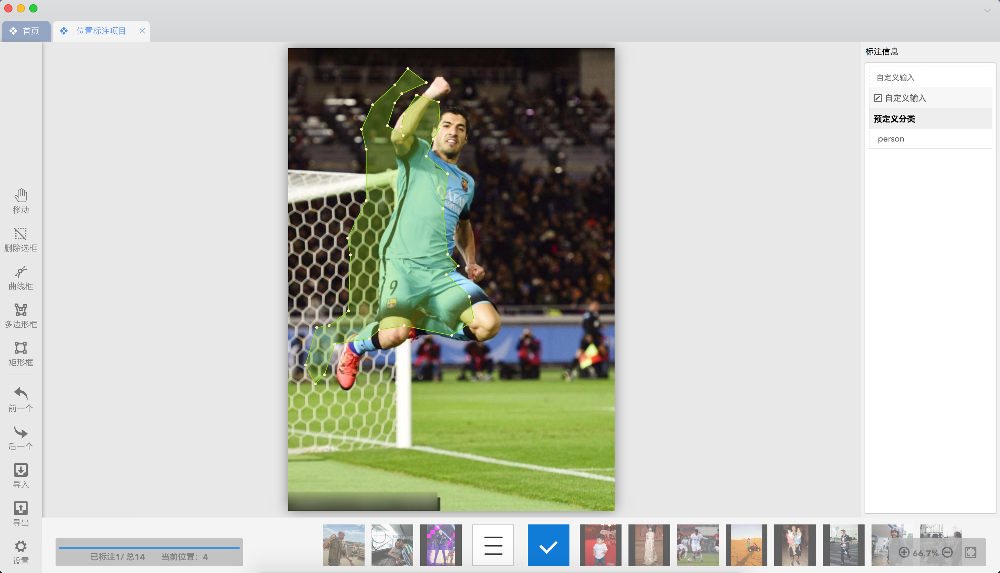
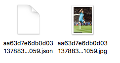
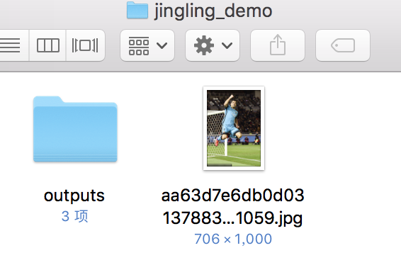
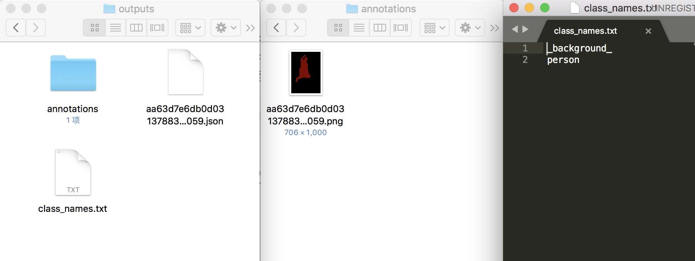

# 精灵标注工具教程

## 1 精灵标注工具的安装

用户在采集完用于训练、评估和预测的图片之后，可使用[精灵数据标注工具](http://www.jinglingbiaozhu.com/)完成数据标注。精灵标注支持在Windows/macOS/Linux三个系统上使用，Mac的话可以到MacStore中搜索colabeler下载即可。

## 2 精灵标注工具的使用

开始标注自定义数据集之前，可以先预览精灵标注官网的[文字教程](http://www.jinglingbiaozhu.com/?type=tutorial&cat_id=4)和[视频教程](http://www.jinglingbiaozhu.com/?type=tutorial&cat_id=5)。


* 开始标注

打开精灵标注工具。

<div align="center">
    
    <p>图1 精灵标注交互界面的示意图</p>
 </div>

请按照下述步骤标注数据集：

(1)   点击`新建`，然后选择`位置标注`，选择`图片文件夹`，修改填写所需的`分类值`（注意：以英文逗号隔开），点击`创建`按钮，软件会自动加载文件夹下的图片（png,jpg,gif）并创建一个项目。

位置标注支持三种类型：矩形，多边形和曲线。选择简单好用的`多边形框`，沿着目标的边缘画多边形，完成后在右侧输入目标的类别。

**注意：切记单张图片标注完成后进行保存，点击下方中央的勾按钮或者使用快捷键ctrl+s**。

然后可以点击左边的前一个后一个或者直接使用键盘的向左按钮和向右按钮来切换图片。

<div align="center">
    
    <p>图2 标注单个目标的示意图</p>
 </div>

(2)   单击目标框，鼠标拖动可以整体移动多边形的位置；点击左侧的`删除选框`可以删除画错的目标框；点击右侧的`标注信息`可修改目标类别。请根据自己的需要执行这一步骤，若不需要修改，可跳过。

<div align="center">
  	
    <p>图3 修改标注的示意图</p>
 </div>

(3)   当所有图片的标注都完成后，点击左侧的`导出`，输出方式选择`JSON`，指定`保存位置`，点击`确定导出`保存所有图片的标注文件。

**注意：导出的标注文件位于`保存位置`下的`outputs`目录。**

精灵标注产出的真值文件可参考我们给出的文件夹[docs/annotation/jingling_demo](jingling_demo)

<div align="center">
    
    <p>图4 精灵标注产出的真值文件的示意图</p>
 </div>

**注意：** 对于中间有空洞的目标（例如游泳圈），暂不支持对空洞部分的标注。如有需要，可借助[labelme](./labelme2seg.md)。

 ## 3 数据格式转换
最后用我们提供的数据转换脚本将上述标注工具产出的数据格式转换为模型训练时所需的数据格式。

* 经过数据格式转换后的数据集目录结构如下：

 ```
 my_dataset                 # 根目录
 |-- outputs                # 标注工具导出目录
 |   |-- annotations            # 数据集真值
 |       |-- xxx.png            # 像素级别的真值信息
 |       |...
 |   |-- class_names.txt        # 数据集的类别名称
 |   |-- xxx.json               # 标注json文件
 |-- xxx.jpg(png or other)  # 数据集原图
 |-- ...

 ```

<div align="center">
    
    <p>图5 格式转换后的数据集目录的结构示意图</p>
 </div>

* 运行以下代码，将标注后的数据转换成满足以上格式的数据集：

```
python pdseg/tools/jingling2seg.py <PATH/TO/LABEL_JSON_FILE>
```

其中，`<PATH/TO/LABEL_JSON_FILE>`为精灵标注产出的json文件所在文件夹的目录，一般为精灵工具使用（3）中`保存位置`下的`outputs`目录。

我们已内置了一个标注的示例，可运行以下代码进行体验：

```
python pdseg/tools/jingling2seg.py docs/annotation/jingling_demo/outputs/
```

转换得到的数据集可参考我们给出的文件夹[docs/annotation/jingling_demo](jingling_demo)。其中，文件`class_names.txt`是数据集中所有标注类别的名称，包含背景类；文件夹`annotations`保存的是各图片的像素级别的真值信息，背景类`_background_`对应为0，其它目标类别从1开始递增，至多为255。

<div align="center">
    
    <p>图6 格式转换后的数据集各目录的内容示意图</p>
 </div>
