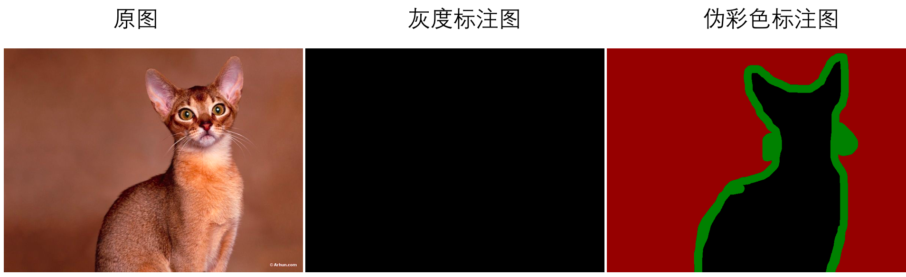
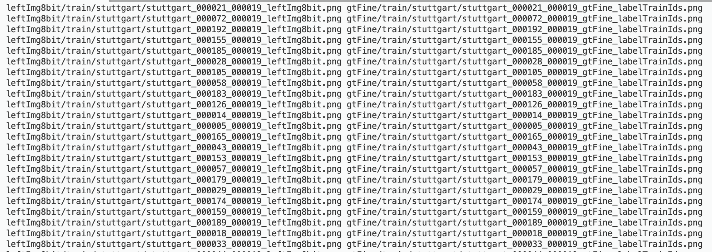
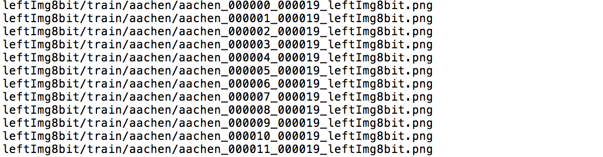

# PaddleSeg 数据准备

## 数据标注

### 标注协议
PaddleSeg采用单通道的标注图片，每一种像素值代表一种类别，像素标注类别需要从0开始递增，例如0，1，2，3表示有4种类别。

**NOTE:** 标注图像请使用PNG无损压缩格式的图片。标注类别最多为256类。

### 灰度标注vs伪彩色标注
一般的分割库使用单通道灰度图作为标注图片，往往显示出来是全黑的效果。灰度标注图的弊端：
1. 对图像标注后，无法直接观察标注是否正确。
2. 模型测试过程无法直接判断分割的实际效果。

**PaddleSeg支持伪彩色图作为标注图片，在原来的单通道图片基础上，注入调色板。在基本不增加图片大小的基础上，却可以显示出彩色的效果。**

同时PaddleSeg也兼容灰度图标注，用户原来的灰度数据集可以不做修改，直接使用。


### 灰度标注转换为伪彩色标注
如果用户需要转换成伪彩色标注图，可使用我们的转换工具。适用于以下两种常见的情况：
1. 如果您希望将指定目录下的所有灰度标注图转换为伪彩色标注图，则执行以下命令，指定灰度标注所在的目录即可。
```buildoutcfg
python pdseg/tools/gray2pseudo_color.py <dir_or_file> <output_dir>
```

|参数|用途|
|-|-|
|dir_or_file|指定灰度标注所在目录|
|output_dir|彩色标注图片的输出目录|

2. 如果您仅希望将指定数据集中的部分灰度标注图转换为伪彩色标注图，则执行以下命令，需要已有文件列表，按列表读取指定图片。
```buildoutcfg
python pdseg/tools/gray2pseudo_color.py <dir_or_file> <output_dir> --dataset_dir <dataset directory> --file_separator <file list separator>
```
|参数|用途|
|-|-|
|dir_or_file|指定文件列表路径|
|output_dir|彩色标注图片的输出目录|
|--dataset_dir|数据集所在根目录|
|--file_separator|文件列表分隔符|

### 标注教程
用户需预先采集好用于训练、评估和测试的图片，然后使用数据标注工具完成数据标注。

PddleSeg已支持2种标注工具：LabelMe、精灵数据标注工具。标注教程如下：

- [LabelMe标注教程](annotation/labelme2seg.md)
- [精灵数据标注工具教程](annotation/jingling2seg.md)


## 文件列表

### 文件列表规范

PaddleSeg采用通用的文件列表方式组织训练集、验证集和测试集。在训练、评估、可视化过程前必须准备好相应的文件列表。

文件列表组织形式如下
```
原始图片路径 [SEP] 标注图片路径
```

其中`[SEP]`是文件路径分割符，可以在`DATASET.SEPARATOR`配置项中修改, 默认为空格。文件列表的路径以数据集根目录作为相对路径起始点，`DATASET.DATA_DIR`即为数据集根目录。

如下图所示，左边为原图的图片路径，右边为图片对应的标注路径。



**注意事项**

* 务必保证分隔符在文件列表中每行只存在一次, 如文件名中存在空格，请使用"|"等文件名不可用字符进行切分

* 文件列表请使用**UTF-8**格式保存, PaddleSeg默认使用UTF-8编码读取file_list文件

若数据集缺少标注图片，则文件列表不用包含分隔符和标注图片路径，如下图所示。



**注意事项**

此时的文件列表仅可在调用`pdseg/vis.py`进行可视化展示时使用，
即仅可在`DATASET.TEST_FILE_LIST`和`DATASET.VIS_FILE_LIST`配置项中使用。
不可在`DATASET.TRAIN_FILE_LIST`和`DATASET.VAL_FILE_LIST`配置项中使用。


**符合规范的文件列表是什么样的呢？**

请参考目录[`./docs/annotation/cityscapes_demo`](../docs/annotation/cityscapes_demo/)。

### 数据集目录结构整理

如果用户想要生成数据集的文件列表，需要整理成如下的目录结构（类似于Cityscapes数据集）：

```
./dataset/   # 数据集根目录
├── annotations      # 标注目录
│   ├── test
│   │   ├── ...
│   │   └── ...
│   ├── train
│   │   ├── ...
│   │   └── ...
│   └── val
│       ├── ...
│       └── ...
└── images       # 原图目录
    ├── test
    │   ├── ...
    │   └── ...
    ├── train
    │   ├── ...
    │   └── ...
    └── val
        ├── ...
        └── ...
Note：以上目录名可任意
```

### 文件列表生成
PaddleSeg提供了生成文件列表的使用脚本，可适用于自定义数据集或cityscapes数据集，并支持通过不同的Flags来开启特定功能。
```
python pdseg/tools/create_dataset_list.py <your/dataset/dir> ${FLAGS}
```
运行后将在数据集根目录下生成训练/验证/测试集的文件列表（文件主名与`--second_folder`一致，扩展名为`.txt`）。

**Note:** 生成文件列表要求：要么原图和标注图片数量一致，要么只有原图，没有标注图片。若数据集缺少标注图片，仍可自动生成不含分隔符和标注图片路径的文件列表。

#### 命令行FLAGS列表

|FLAG|用途|默认值|参数数目|
|-|-|-|-|
|--type|指定数据集类型，`cityscapes`或`自定义`|`自定义`|1|
|--separator|文件列表分隔符|"&#124;"|1|
|--folder|图片和标签集的文件夹名|"images" "annotations"|2|
|--second_folder|训练/验证/测试集的文件夹名|"train" "val" "test"|若干|
|--format|图片和标签集的数据格式|"jpg"  "png"|2|
|--postfix|按文件主名（无扩展名）是否包含指定后缀对图片和标签集进行筛选|""   ""（2个空字符）|2|

#### 使用示例
- **对于自定义数据集**

若您已经按上述说明整理好了数据集目录结构，可以运行下面的命令生成文件列表。

```
# 生成文件列表，其分隔符为空格，图片和标签集的数据格式都为png
python pdseg/tools/create_dataset_list.py <your/dataset/dir> --separator " " --format png png
```
```
# 生成文件列表，其图片和标签集的文件夹名为img和gt，训练和验证集的文件夹名为training和validation，不生成测试集列表
python pdseg/tools/create_dataset_list.py <your/dataset/dir> \
        --folder img gt --second_folder training validation
```
**Note:** 必须指定自定义数据集目录，可以按需要设定FLAG。无需指定`--type`。

- **对于cityscapes数据集**

若您使用的是cityscapes数据集，可以运行下面的命令生成文件列表。

```
# 生成cityscapes文件列表，其分隔符为逗号
python pdseg/tools/create_dataset_list.py <your/dataset/dir> --type cityscapes --separator ","
```
**Note:**

必须指定cityscapes数据集目录，`--type`必须为`cityscapes`。

在cityscapes类型下，部分FLAG将被重新设定，无需手动指定，具体如下：

|FLAG|固定值|
|-|-|
|--folder|"leftImg8bit" "gtFine"|
|--format|"png" "png"|
|--postfix|"_leftImg8bit" "_gtFine_labelTrainIds"|

其余FLAG可以按需要设定。
