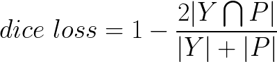
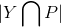
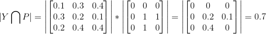
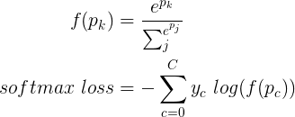
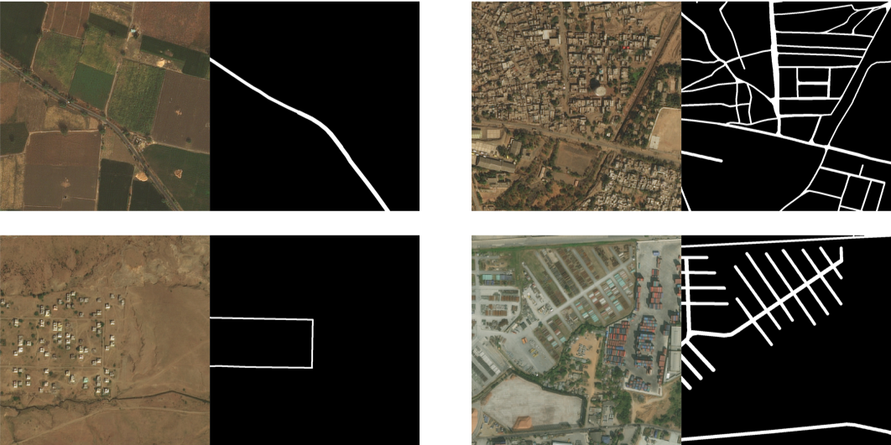
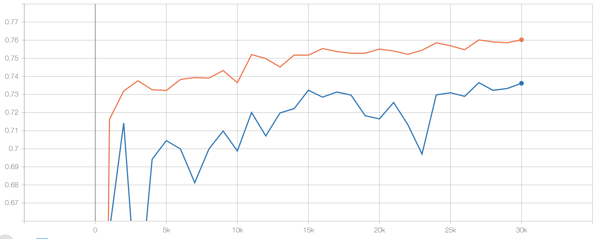

# Dice loss
对于二类图像分割任务中，经常出现类别分布不均匀的情况，例如：工业产品的瑕疵检测、道路提取及病变区域提取等。我们可使用dice loss(dice coefficient loss)解决这个问题。

注：dice loss和bce loss仅支持二分类。

## 原理介绍
Dice loss的定义如下：

<p align="center">
   <br />
 </p>


其中 Y 表示ground truth，P 表示预测结果。| |表示矩阵元素之和。 表示*Y*和*P*的共有元素数，
实际通过求两者的逐像素乘积之和进行计算。例如：

<p align="center">
   <br />
 </p>

其中 1 表示前景，0 表示背景。

**Note：** 在标注图片中，务必保证前景像素值为1，背景像素值为0.

Dice系数请参见[维基百科](https://zh.wikipedia.org/wiki/Dice%E7%B3%BB%E6%95%B0)

**为什么在类别不均衡问题上，dice loss效果比softmax loss更好？**

首先来看softmax loss的定义：

<p align="center">
   <br />
 </p>

其中 y 表示ground truth，p 表示网络输出。

在图像分割中，`softmax loss`评估每一个像素点的类别预测，然后平均所有的像素点。这个本质上就是对图片上的每个像素进行平等的学习。这就造成了一个问题，如果在图像上的多种类别有不平衡的表征，那么训练会由最主流的类别主导。以上面DeepGlobe道路提取的数据为例子，网络将偏向于背景的学习，降低了网络对前景目标的提取能力。
而`dice loss(dice coefficient loss)`通过预测和标注的交集除以它们的总体像素进行计算，它将一个类别的所有像素作为一个整体作为考量，而且计算交集在总体中的占比，所以不受大量背景像素的影响，能够取得更好的效果。

在实际应用中`dice loss`往往与`bce loss(binary cross entropy loss)`结合使用，提高模型训练的稳定性。


## PaddleSeg指定训练loss

PaddleSeg通过`cfg.SOLVER.LOSS`参数可以选择训练时的损失函数，
如`cfg.SOLVER.LOSS=['dice_loss','bce_loss']`将指定训练loss为`dice loss`与`bce loss`的组合

## Dice loss解决类别不均衡问题的示例

我们以道路提取任务为例应用dice loss.
在DeepGlobe比赛的Road Extraction中，训练数据道路占比为：4.5%. 如下为其图片样例：
<p align="center">
   <br />
 </p>
可以看出道路在整张图片中的比例很小。

### 数据集下载
我们从DeepGlobe比赛的Road Extraction的训练集中随机抽取了800张图片作为训练集，200张图片作为验证集，
制作了一个小型的道路提取数据集[MiniDeepGlobeRoadExtraction](https://paddleseg.bj.bcebos.com/dataset/MiniDeepGlobeRoadExtraction.zip)

### 实验比较

在MiniDeepGlobeRoadExtraction数据集进行了实验比较。

* 数据集下载
```shell
python dataset/download_mini_deepglobe_road_extraction.py
```

* 预训练模型下载
```shell
python pretrained_model/download_model.py deeplabv3p_mobilenetv2-1-0_bn_coco
```
* 配置/数据校验
```shell
python pdseg/check.py --cfg ./configs/deepglobe_road_extraction.yaml
```

* 训练
```shell
python pdseg/train.py --cfg ./configs/deepglobe_road_extraction.yaml --use_gpu SOLVER.LOSS "['dice_loss','bce_loss']"

```

* 评估
```
python pdseg/eval.py --cfg ./configs/deepglobe_road_extraction.yaml --use_gpu SOLVER.LOSS "['dice_loss','bce_loss']"

```

* 结果比较

softmax loss和dice loss + bce loss实验结果如下图所示。
图中橙色曲线为dice loss + bce loss，最高mIoU为76.02%，蓝色曲线为softmax loss， 最高mIoU为73.62%。
<p align="center">
   <br />
 </p>
