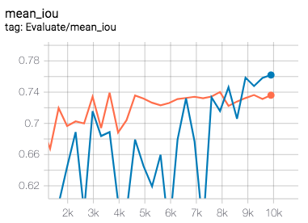
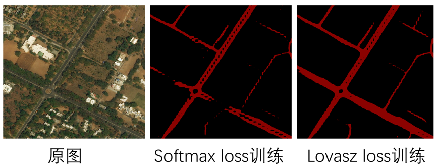
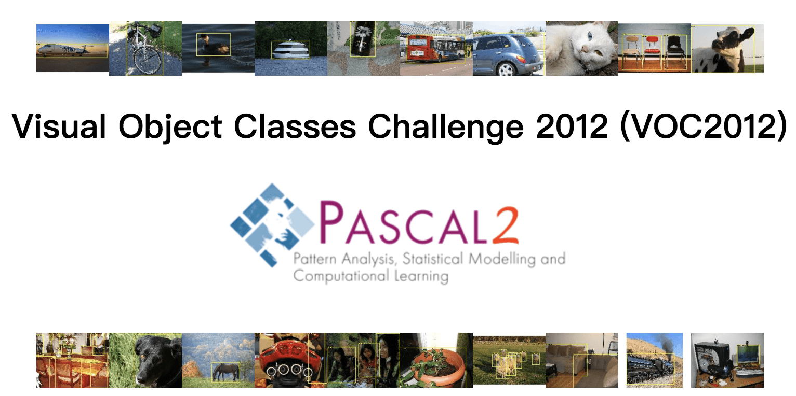
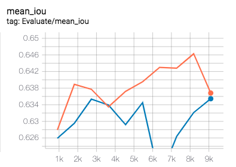

# Lovasz loss
对于图像分割任务中，经常出现类别分布不均匀的情况，例如：工业产品的瑕疵检测、道路提取及病变区域提取等。我们可使用lovasz loss解决这个问题。

Lovasz loss基于子模损失(submodular losses)的凸Lovasz扩展，对神经网络的mean IoU损失进行优化。Lovasz loss根据分割目标的类别数量可分为两种：lovasz hinge loss和lovasz softmax loss. 其中lovasz hinge loss适用于二分类问题，lovasz softmax loss适用于多分类问题。该工作发表在CVPR 2018上，可点击[参考文献](#参考文献)查看具体原理。


## Lovasz loss使用指南
接下来介绍如何使用lovasz loss进行训练。需要注意的是，通常的直接训练方式并一定管用，我们推荐另外2种训练方式：
- （1）与softmax loss或bce loss(binary cross-entropy loss)加权结合使用。
- （2）先使用softmax loss或bec loss进行训练，再使用lovasz softmax loss或lovasz hinge loss进行finetuning.

配置lovasz loss仅需要设定2个参数：

首先通过`cfg.SOLVER.LOSS`参数选择训练时的损失函数， 例如`cfg.SOLVER.LOSS=['lovasz_hinge_loss','bce_loss']`将指定训练loss为lovasz hinge loss与bce loss的组合。`cfg.SOLVER.LOSS=['lovasz_softmax_loss','softmax_loss']`将指定训练loss为lovasz softmax loss与softmax loss的组合。

其次，也可以通过`cfg.SOLVER.LOSS_WEIGHT`参数对不同loss进行权重配比，从而灵活地进行训练调参。Lovasz hinge loss配置位于`PaddleSeg/configs/lovasz_hinge_deeplabv3p_mobilenet_road.yaml`，如下所示：
```yaml
SOLVER:
    LOSS: ["lovasz_hinge_loss","bce_loss"]
    LOSS_WEIGHT:
        LOVASZ_HINGE_LOSS: 0.5
        BCE_LOSS: 0.5
```

Lovasz softmax loss配置位于`PaddleSeg/configs/lovasz_softmax_deeplabv3p_mobilenet_pascal.yaml`，如下所示：

```yaml
SOLVER:
    LOSS: ["lovasz_softmax_loss","softmax_loss"]
    LOSS_WEIGHT:
        LOVASZ_SOFTMAX_LOSS: 0.2
        SOFTMAX_LOSS: 0.8
```

## Lovasz hinge loss实验对比

我们以道路提取任务为例应用lovasz hinge loss.
基于MiniDeepGlobeRoadExtraction数据集与bce loss进行了实验对比。
该数据集来源于DeepGlobe比赛的Road Extraction单项，训练数据道路占比为：4.5%. 道路在整张图片中的比例很小，是典型的类别不均衡场景。图片样例如下：
<p align="center">
   <br />
 </p>

为进行快速体验，这里使用DeepLabv3+模型，backbone为MobileNetV2.

* 数据集下载
我们从DeepGlobe比赛的Road Extraction的训练集中随机抽取了800张图片作为训练集，200张图片作为验证集，
制作了一个小型的道路提取数据集[MiniDeepGlobeRoadExtraction](https://paddleseg.bj.bcebos.com/dataset/MiniDeepGlobeRoadExtraction.zip)

```shell
python dataset/download_mini_deepglobe_road_extraction.py
```

* 预训练模型下载
```shell
python pretrained_model/download_model.py deeplabv3p_mobilenetv2-1-0_bn_coco
```
* 配置/数据校验
```shell
python pdseg/check.py --cfg ./configs/lovasz_hinge_deeplabv3p_mobilenet_road.yaml
```

* 训练
```shell
python pdseg/train.py --cfg ./configs/lovasz_hinge_deeplabv3p_mobilenet_road.yaml --use_gpu --use_mpio SOLVER.LOSS "['lovasz_hinge_loss','bce_loss']"
```

* 评估
```shell
python pdseg/eval.py --cfg ./configs/lovasz_hinge_deeplabv3p_mobilenet_road.yaml --use_gpu --use_mpio SOLVER.LOSS "['lovasz_hinge_loss','bce_loss']"
```

* 结果比较

lovasz hinge loss + bce loss和softmax loss的mIoU曲线如下图所示。
<p align="center">
   <br />
 </p>

图中蓝色曲线为lovasz hinge loss + bce loss，最高mIoU为76.2%，橙色曲线为softmax loss， 最高mIoU为73.44%，相比提升2.76个百分点。

分割效果如下：
<p align="center">
   <br />
 </p>

可以看出，softmax loss训练的结果中道路并不连续，主干道部分缺失尤为严重。而lovasz loss训练的结果提升显著，主干道并无缺失，连小路也基本连续。

## Lovasz softmax loss实验对比

接下来以PASCAL VOC 2012数据集为例应用lovasz softmax loss. 我们将lovasz softmax loss与softmax loss进行了实验对比。为进行快速体验，这里使用DeepLabv3+模型，backbone为MobileNetV2.


* 数据集下载
<p align="center">
   <br />
 </p>

```shell
python dataset/download_and_convert_voc2012.py
```

* 预训练模型下载
```shell
python pretrained_model/download_model.py deeplabv3p_mobilenetv2-1-0_bn_coco
```
* 配置/数据校验
```shell
python pdseg/check.py --cfg ./configs/lovasz_softmax_deeplabv3p_mobilenet_pascal.yaml
```

* 训练
```shell
python pdseg/train.py --cfg ./configs/lovasz_softmax_deeplabv3p_mobilenet_pascal.yaml --use_gpu --use_mpio SOLVER.LOSS "['lovasz_softmax_loss','softmax_loss']"

```

* 评估
```shell
python pdseg/eval.py --cfg ./configs/lovasz_softmax_deeplabv3p_mobilenet_pascal.yaml --use_gpu --use_mpio SOLVER.LOSS "['lovasz_softmax_loss','softmax_loss']"

```

* 结果比较

lovasz softmax loss + softmax loss和softmax loss的mIoU曲线如下图所示。
<p align="center">
   <br />
 </p>

图中橙色曲线代表lovasz softmax loss + softmax loss，最高mIoU为64.63%，蓝色曲线代表softmax loss， 最高mIoU为63.55%，相比提升1.08个百分点。


## 参考文献
[Berman M, Rannen Triki A, Blaschko M B. The lovász-softmax loss: a tractable surrogate for the optimization of the intersection-over-union measure in neural networks[C]//Proceedings of the IEEE Conference on Computer Vision and Pattern Recognition. 2018: 4413-4421.](http://openaccess.thecvf.com/content_cvpr_2018/html/Berman_The_LovaSz-Softmax_Loss_CVPR_2018_paper.html)
