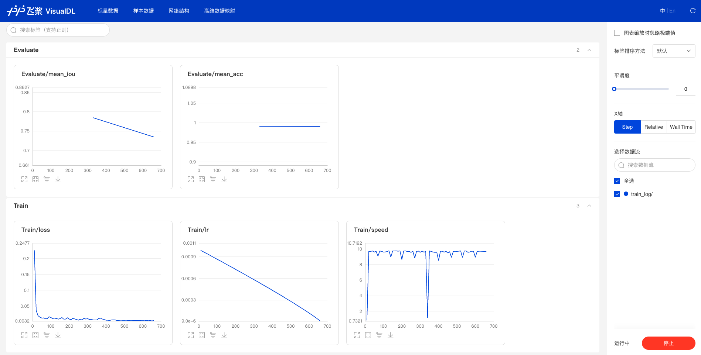
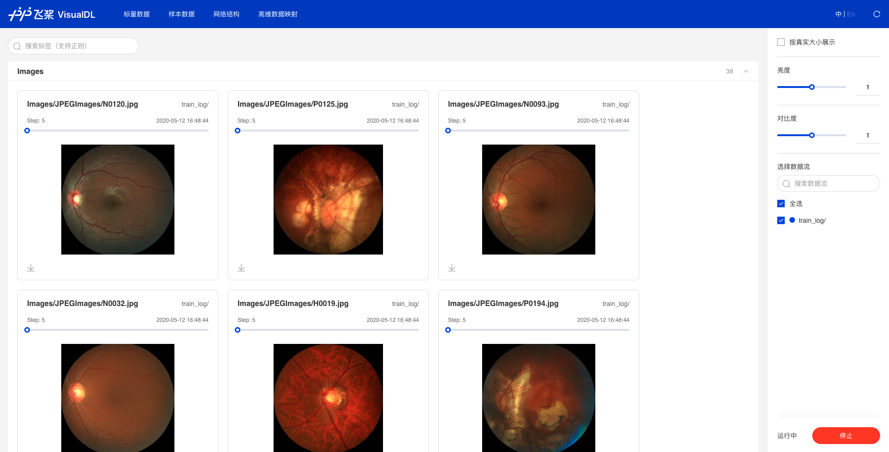
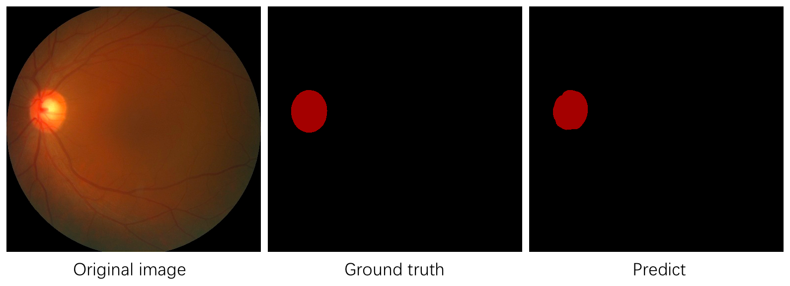

# PaddleSeg快速入门

本教程通过一个简单的示例，说明如何基于PaddleSeg启动训练（训练可视化）、评估和可视化。我们选择基于COCO数据集预训练的unet模型作为预训练模型，以一个眼底医疗分割数据集为例。

- [1.准备工作](#1准备工作)
- [2.下载待训练数据](#2下载待训练数据)
- [3.下载预训练模型](#3下载预训练模型)
- [4.模型训练](#4模型训练)
- [5.训练过程可视化](#5训练过程可视化)
- [6.模型评估](#6模型评估)
- [7.模型可视化](#7模型可视化)
- [在线体验](#在线体验)


## 1.准备工作
在开始教程前，请先确认准备工作已经完成：
1. 正确安装了PaddlePaddle
2. PaddleSeg相关依赖已经安装

如果有不确认的地方，请参考[首页安装说明](../README.md#安装)

## 2.下载待训练数据


我们提前准备好了一份眼底医疗分割数据集--视盘分割（optic disc segmentation），包含267张训练图片、76张验证图片、38张测试图片。通过以下命令进行下载：

```shell
# 下载待训练数据集
python dataset/download_optic.py
```

## 3.下载预训练模型
```shell
# 下载预训练模型并进行解压
python pretrained_model/download_model.py unet_bn_coco
```

## 4.模型训练

为了方便体验，我们在configs目录下放置了配置文件`unet_optic.yaml`，可以通过`--cfg`指向该文件来设置训练配置。

可以通过环境变量`CUDA_VISIBLE_DEVICES`来指定GPU卡号。

```
# 指定GPU卡号（以0号卡为例）
export CUDA_VISIBLE_DEVICES=0
# 训练
python pdseg/train.py --cfg configs/unet_optic.yaml \
                      --use_gpu \
                      --do_eval \
                      --use_vdl \
                      --vdl_log_dir train_log \
                      BATCH_SIZE 4 \
                      SOLVER.LR 0.001

```
若需要使用多块GPU，以0、1、2号卡为例，可输入
```
export CUDA_VISIBLE_DEVICES=0,1,2
```


**NOTE:**

* 如果发现因为内存不足而Crash。请适当调低`BATCH_SIZE`。如果本机GPU内存充足，则可以调高`BATCH_SIZE`的大小以获得更快的训练速度，`BATCH_SIZE`增大时，可以适当调高学习率`SOLVER.LR`.

* 如果在Linux系统下训练，可以使用`--use_mpio`使用多进程I/O，通过提升数据增强的处理速度进而大幅度提升GPU利用率。


## 5.训练过程可视化

训练过程可视化需要在启动训练脚本`train.py`时，打开`--do_eval`和`--use_vdl`两个开关，并设置日志保存目录`--vdl_log_dir`，然后便可以通过VisualDL查看边训练边评估的效果。

```shell
visualdl --logdir train_log --host {$HOST_IP} --port {$PORT}
```

NOTE:
1. 上述示例中，$HOST\_IP为机器IP地址，请替换为实际IP，$PORT请替换为可访问的端口。
2. 数据量较大时，前端加载速度会比较慢，请耐心等待。

启动VisualDL命令后，我们可以在浏览器中查看对应的训练数据。
在`SCALAR`这个tab中，查看训练loss、iou、acc的变化趋势。


在`IMAGE`这个tab中，查看样本图片。


## 6.模型评估
训练完成后，我们可以通过eval.py来评估模型效果。由于我们设置的训练EPOCH数量为10，保存间隔为5，因此一共会产生2个定期保存的模型，加上最终保存的final模型，一共有3个模型。我们选择最后保存的模型进行效果的评估：

```shell
python pdseg/eval.py --use_gpu \
                     --cfg configs/unet_optic.yaml \
                     TEST.TEST_MODEL saved_model/unet_optic/final
```

可以看到，在经过训练后，模型在验证集上的mIoU指标达到了0.85+（由于随机种子等因素的影响，效果会有小范围波动，属于正常情况）。

## 7.模型可视化
通过vis.py进行测试和可视化，以选择最后保存的模型进行测试为例：
```shell
python pdseg/vis.py --use_gpu \
                     --cfg configs/unet_optic.yaml \
                     TEST.TEST_MODEL saved_model/unet_optic/final
```
执行上述脚本后，会在主目录下产生一个visual文件夹，里面存放着测试集图片的预测结果，我们选择其中1张图片进行查看:



`NOTE`
1. 可视化的图片会默认保存在visual目录下，可以通过`--vis_dir`来指定输出目录。
2. 训练过程中会使用`DATASET.VIS_FILE_LIST`中的图片进行可视化显示，而vis.py则会使用`DATASET.TEST_FILE_LIST`.

## 在线体验

PaddleSeg在AI Studio平台上提供了在线体验的快速入门教程，欢迎[点击体验](https://aistudio.baidu.com/aistudio/projectdetail/100798)
