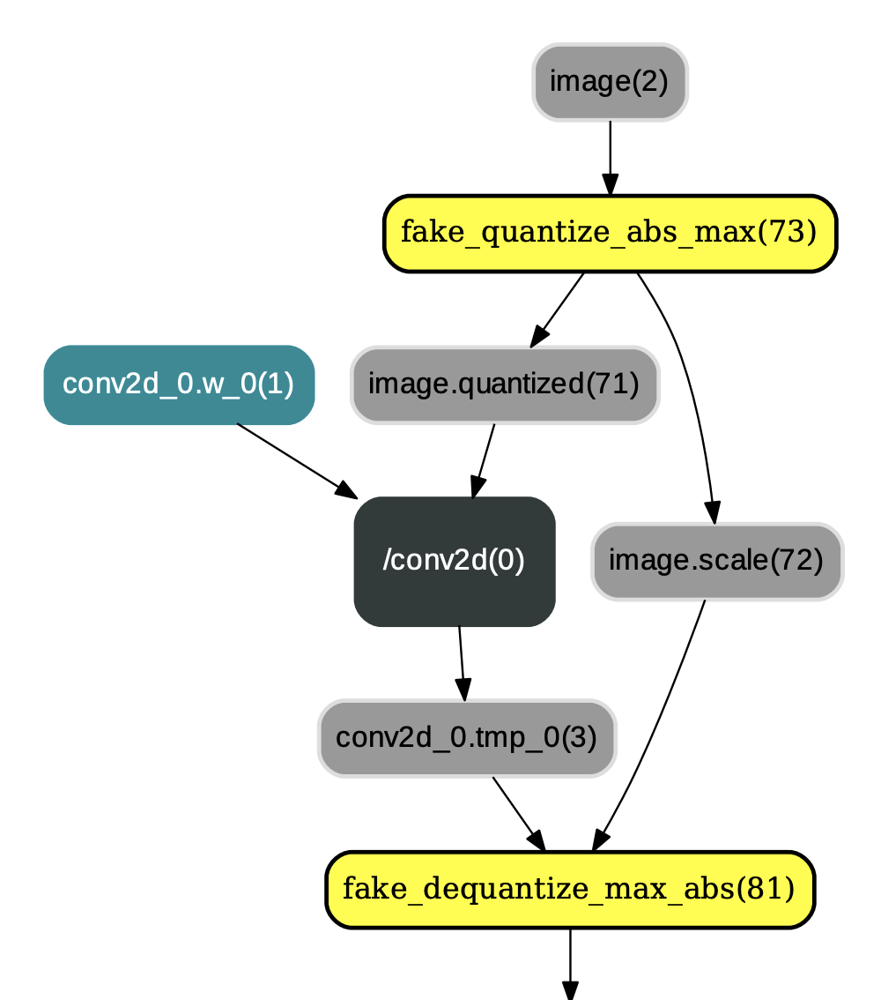

>运行该示例前请安装Paddle1.6或更高版本和PaddleSlim

# 分割模型量化压缩示例

## 概述

该示例使用PaddleSlim提供的[量化压缩API](https://paddlepaddle.github.io/PaddleSlim/api/quantization_api/)对分割模型进行压缩。
在阅读该示例前，建议您先了解以下内容：

- [分割模型的常规训练方法](../../docs/usage.md)
- [PaddleSlim使用文档](https://paddlepaddle.github.io/PaddleSlim/)


## 安装PaddleSlim
可按照[PaddleSlim使用文档](https://paddlepaddle.github.io/PaddleSlim/)中的步骤安装PaddleSlim。


## 训练


### 数据集
请按照分割库的教程下载数据集并放到对应位置。

### 下载训练好的分割模型

在分割库根目录下运行以下命令：
```bash
mkdir pretrain
cd pretrain
wget https://paddleseg.bj.bcebos.com/models/mobilenet_cityscapes.tgz
tar xf mobilenet_cityscapes.tgz
```

### 定义量化配置
config = {
        'weight_quantize_type': 'channel_wise_abs_max',
        'activation_quantize_type': 'moving_average_abs_max',
        'quantize_op_types': ['depthwise_conv2d', 'mul', 'conv2d'],
        'not_quant_pattern': ['last_conv']
    }

如何配置以及含义请参考[PaddleSlim 量化API](https://paddlepaddle.github.io/PaddleSlim/api/quantization_api/)。

### 插入量化反量化OP
使用[PaddleSlim quant_aware API](https://paddlepaddle.github.io/PaddleSlim/api/quantization_api/#quant_aware)在Program中插入量化和反量化OP。
```
compiled_train_prog = quant_aware(train_prog, place, config, for_test=False)
```

### 关闭一些训练策略

因为量化要对Program做修改，所以一些会修改Program的训练策略需要关闭。``sync_batch_norm`` 和量化多卡训练同时使用时会出错, 需要将其关闭。
```
build_strategy.fuse_all_reduce_ops = False
build_strategy.sync_batch_norm = False
```

### 开始训练


step1: 设置gpu卡
```
export CUDA_VISIBLE_DEVICES=0
```
step2: 将``pdseg``文件夹加到系统路径

分割库根目录下运行以下命令
```
export PYTHONPATH=$PYTHONPATH:./pdseg
```

step2: 开始训练


在分割库根目录下运行以下命令进行训练。
```
python -u ./slim/quantization/train_quant.py --log_steps 10 --not_quant_pattern last_conv --cfg configs/deeplabv3p_mobilenetv2_cityscapes.yaml --use_gpu --use_mpio --do_eval \
TRAIN.PRETRAINED_MODEL_DIR "./pretrain/mobilenet_cityscapes/" \
TRAIN.MODEL_SAVE_DIR "./snapshots/mobilenetv2_quant" \
MODEL.DEEPLAB.ENCODER_WITH_ASPP False \
MODEL.DEEPLAB.ENABLE_DECODER False \
TRAIN.SYNC_BATCH_NORM False \
SOLVER.LR 0.0001 \
TRAIN.SNAPSHOT_EPOCH 1 \
SOLVER.NUM_EPOCHS 30 \
BATCH_SIZE 16 \
```


### 训练时的模型结构
[PaddleSlim 量化API](https://paddlepaddle.github.io/PaddleSlim/api/quantization_api/)文档中介绍了``paddleslim.quant.quant_aware``和``paddleslim.quant.convert``两个接口。
``paddleslim.quant.quant_aware`` 作用是在网络中的conv2d、depthwise_conv2d、mul等算子的各个输入前插入连续的量化op和反量化op，并改变相应反向算子的某些输入。示例图如下：

<p align="center">
 <br />
<strong>图1：应用 paddleslim.quant.quant_aware 后的结果</strong>
</p>


### 边训练边测试

在脚本中边训练边测试得到的测试精度是基于图1中的网络结构进行的。

## 评估

### 最终评估模型

``paddleslim.quant.convert`` 主要用于改变Program中量化op和反量化op的顺序，即将类似图1中的量化op和反量化op顺序改变为图2中的布局。除此之外，``paddleslim.quant.convert`` 还会将`conv2d`、`depthwise_conv2d`、`mul`等算子参数变为量化后的int8_t范围内的值(但数据类型仍为float32)，示例如图2：

<p align="center">
 <br />
<strong>图2：paddleslim.quant.convert 后的结果</strong>
</p>

所以在调用 ``paddleslim.quant.convert`` 之后，才得到最终的量化模型。此模型可使用PaddleLite进行加载预测，可参见教程[Paddle-Lite如何加载运行量化模型](https://github.com/PaddlePaddle/Paddle-Lite/wiki/model_quantization)。

### 评估脚本
使用脚本[slim/quantization/eval_quant.py](./eval_quant.py)进行评估。

- 定义配置。使用和训练脚本中一样的量化配置，以得到和量化训练时同样的模型。
- 使用 ``paddleslim.quant.quant_aware`` 插入量化和反量化op。
- 使用 ``paddleslim.quant.convert`` 改变op顺序，得到最终量化模型进行评估。

评估命令：

分割库根目录下运行
```
python -u ./slim/quantization/eval_quant.py  --cfg configs/deeplabv3p_mobilenetv2_cityscapes.yaml  --use_gpu --not_quant_pattern last_conv  --use_mpio --convert \
TEST.TEST_MODEL "./snapshots/mobilenetv2_quant/best_model" \
MODEL.DEEPLAB.ENCODER_WITH_ASPP False \
MODEL.DEEPLAB.ENABLE_DECODER False \
TRAIN.SYNC_BATCH_NORM False \
BATCH_SIZE 16 \
```

## 导出模型
使用脚本[slim/quantization/export_model.py](./export_model.py)导出模型。

导出命令：

分割库根目录下运行
```
python -u ./slim/quantization/export_model.py --not_quant_pattern last_conv  --cfg configs/deeplabv3p_mobilenetv2_cityscapes.yaml  \
TEST.TEST_MODEL "./snapshots/mobilenetv2_quant/best_model" \
MODEL.DEEPLAB.ENCODER_WITH_ASPP False \
MODEL.DEEPLAB.ENABLE_DECODER False \
TRAIN.SYNC_BATCH_NORM False \
SLIM.PREPROCESS True \
```

## 预测部署

请参考[量化模型部署文档](./deploy/)

## 量化结果


## FAQ
