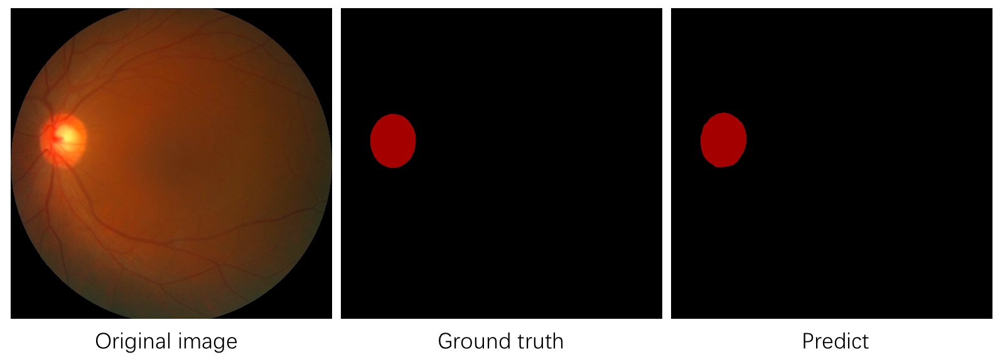

# DeepLabv3+模型使用教程

本教程旨在介绍如何使用`DeepLabv3+`预训练模型在自定义数据集上进行训练、评估和可视化。我们以`DeeplabV3+/Xception65/BatchNorm`预训练模型为例。

* 在阅读本教程前，请确保您已经了解过PaddleSeg的[快速入门](../README.md#快速入门)和[基础功能](../README.md#基础功能)等章节，以便对PaddleSeg有一定的了解。

* 本教程的所有命令都基于PaddleSeg主目录进行执行。

## 一. 准备待训练数据


我们提前准备好了一份眼底医疗分割数据集，包含267张训练图片、76张验证图片、38张测试图片。通过以下命令进行下载：

```shell
python dataset/download_optic.py
```

## 二. 下载预训练模型

接着下载对应的预训练模型

```shell
python pretrained_model/download_model.py deeplabv3p_xception65_bn_coco
```

关于已有的DeepLabv3+预训练模型的列表，请参见[模型组合](#模型组合)。如果需要使用其他预训练模型，下载该模型并将配置中的BACKBONE、NORM_TYPE等进行替换即可。


## 三. 准备配置

接着我们需要确定相关配置，从本教程的角度，配置分为三部分：

* 数据集
  * 训练集主目录
  * 训练集文件列表
  * 测试集文件列表
  * 评估集文件列表
* 预训练模型
  * 预训练模型名称
  * 预训练模型的backbone网络
  * 预训练模型的Normalization类型
  * 预训练模型路径
* 其他
  * 学习率
  * Batch大小
  * ...

在三者中，预训练模型的配置尤为重要，如果模型或者BACKBONE配置错误，会导致预训练的参数没有加载，进而影响收敛速度。预训练模型相关的配置如第二步所展示。

数据集的配置和数据路径有关，在本教程中，数据存放在`dataset/optic_disc_seg`中。

其他配置则根据数据集和机器环境的情况进行调节，最终我们保存一个如下内容的yaml配置文件，存放路径为**configs/deeplabv3p_xception65_optic.yaml**。

```yaml
# 数据集配置
DATASET:
    DATA_DIR: "./dataset/optic_disc_seg/"
    NUM_CLASSES: 2
    TEST_FILE_LIST: "./dataset/optic_disc_seg/test_list.txt"
    TRAIN_FILE_LIST: "./dataset/optic_disc_seg/train_list.txt"
    VAL_FILE_LIST: "./dataset/optic_disc_seg/val_list.txt"
    VIS_FILE_LIST: "./dataset/optic_disc_seg/test_list.txt"

# 预训练模型配置
MODEL:
    MODEL_NAME: "deeplabv3p"
    DEFAULT_NORM_TYPE: "bn"
    DEEPLAB:
        BACKBONE: "xception_65"

# 其他配置
TRAIN_CROP_SIZE: (512, 512)
EVAL_CROP_SIZE: (512, 512)
AUG:
    AUG_METHOD: "unpadding"
    FIX_RESIZE_SIZE: (512, 512)
BATCH_SIZE: 4
TRAIN:
    PRETRAINED_MODEL_DIR: "./pretrained_model/deeplabv3p_xception65_bn_coco/"
    MODEL_SAVE_DIR: "./saved_model/deeplabv3p_xception65_bn_optic/"
    SNAPSHOT_EPOCH: 5
TEST:
    TEST_MODEL: "./saved_model/deeplabv3p_xception65_bn_optic/final"
SOLVER:
    NUM_EPOCHS: 10
    LR: 0.001
    LR_POLICY: "poly"
    OPTIMIZER: "adam"
```

## 四. 配置/数据校验

在开始训练和评估之前，我们还需要对配置和数据进行一次校验，确保数据和配置是正确的。使用下述命令启动校验流程

```shell
python pdseg/check.py --cfg ./configs/deeplabv3p_xception65_optic.yaml
```


## 五. 开始训练

校验通过后，使用下述命令启动训练

```shell
# 指定GPU卡号（以0号卡为例）
export CUDA_VISIBLE_DEVICES=0
# 训练
python pdseg/train.py --use_gpu --cfg ./configs/deeplabv3p_xception65_optic.yaml
```

## 六. 进行评估

模型训练完成，使用下述命令启动评估

```shell
python pdseg/eval.py --use_gpu --cfg ./configs/deeplabv3p_xception65_optic.yaml
```

## 七. 进行可视化

使用下述命令启动预测和可视化

```shell
python pdseg/vis.py --use_gpu --cfg ./configs/deeplabv3p_xception65_optic.yaml
```

预测结果将保存在`visual`目录下，以下展示其中1张图片的预测效果：



## 在线体验

PaddleSeg在AI Studio平台上提供了在线体验的DeepLabv3+图像分割教程，欢迎[点击体验](https://aistudio.baidu.com/aistudio/projectDetail/226703)。


## 模型组合

|预训练模型名称|Backbone|Norm Type|数据集|配置|
|-|-|-|-|-|
|mobilenetv2-2-0_bn_imagenet|MobileNetV2|bn|ImageNet|MODEL.MODEL_NAME: deeplabv3p <br> MODEL.DEEPLAB.BACKBONE: mobilenetv2 <br> MODEL.DEEPLAB.DEPTH_MULTIPLIER: 2.0 <br> MODEL.DEFAULT_NORM_TYPE: bn|
|mobilenetv2-1-5_bn_imagenet|MobileNetV2|bn|ImageNet|MODEL.MODEL_NAME: deeplabv3p <br> MODEL.DEEPLAB.BACKBONE: mobilenetv2 <br> MODEL.DEEPLAB.DEPTH_MULTIPLIER: 1.5 <br> MODEL.DEFAULT_NORM_TYPE: bn|
|mobilenetv2-1-0_bn_imagenet|MobileNetV2|bn|ImageNet|MODEL.MODEL_NAME: deeplabv3p <br> MODEL.DEEPLAB.BACKBONE: mobilenetv2 <br> MODEL.DEEPLAB.DEPTH_MULTIPLIER: 1.0 <br> MODEL.DEFAULT_NORM_TYPE: bn|
|mobilenetv2-0-5_bn_imagenet|MobileNetV2|bn|ImageNet|MODEL.MODEL_NAME: deeplabv3p <br> MODEL.DEEPLAB.BACKBONE: mobilenetv2 <br> MODEL.DEEPLAB.DEPTH_MULTIPLIER: 0.5 <br> MODEL.DEFAULT_NORM_TYPE: bn|
|mobilenetv2-0-25_bn_imagenet|MobileNetV2|bn|ImageNet|MODEL.MODEL_NAME: deeplabv3p <br> MODEL.DEEPLAB.BACKBONE: mobilenetv2 <br> MODEL.DEEPLAB.DEPTH_MULTIPLIER: 0.25 <br> MODEL.DEFAULT_NORM_TYPE: bn|
|xception41_imagenet|Xception41|bn|ImageNet|MODEL.MODEL_NAME: deeplabv3p <br> MODEL.DEEPLAB.BACKBONE: xception_41 <br> MODEL.DEFAULT_NORM_TYPE: bn|
|xception65_imagenet|Xception65|bn|ImageNet|MODEL.MODEL_NAME: deeplabv3p <br> MODEL.DEEPLAB.BACKBONE: xception_65 <br> MODEL.DEFAULT_NORM_TYPE: bn|
|resnet50_vd_imagenet|ResNet50_vd|bn|ImageNet|MODEL.MODEL_NAME: deeplabv3p <br> MODEL.DEEPLAB.BACKBONE: resnet50_vd <br> MODEL.DEFAULT_NORM_TYPE: bn|
|deeplabv3p_mobilenetv2-1-0_bn_coco|MobileNetV2|bn|COCO|MODEL.MODEL_NAME: deeplabv3p <br> MODEL.DEEPLAB.BACKBONE: mobilenetv2 <br> MODEL.DEEPLAB.DEPTH_MULTIPLIER: 1.0 <br> MODEL.DEEPLAB.ENCODER_WITH_ASPP: False <br> MODEL.DEEPLAB.ENABLE_DECODER: False <br> MODEL.DEFAULT_NORM_TYPE: bn|
|**deeplabv3p_xception65_bn_coco**|Xception65|bn|COCO|MODEL.MODEL_NAME: deeplabv3p <br> MODEL.DEEPLAB.BACKBONE: xception_65 <br> MODEL.DEFAULT_NORM_TYPE: bn |
|deeplabv3p_mobilenetv2-1-0_bn_cityscapes|MobileNetV2|bn|Cityscapes|MODEL.MODEL_NAME: deeplabv3p <br> MODEL.DEEPLAB.BACKBONE: mobilenetv2 <br> MODEL.DEEPLAB.DEPTH_MULTIPLIER: 1.0 <br> MODEL.DEEPLAB.ENCODER_WITH_ASPP: False <br> MODEL.DEEPLAB.ENABLE_DECODER: False <br> MODEL.DEFAULT_NORM_TYPE: bn|
|deeplabv3p_mobilenetv3_large_cityscapes|MobileNetV3|bn|Cityscapes|MODEL.MODEL_NAME: deeplabv3p <br> MODEL.DEEPLAB.BACKBONE: mobilenetv3_large <br> MODEL.DEFAULT_NORM_TYPE: bn|
|deeplabv3p_xception65_gn_cityscapes|Xception65|gn|Cityscapes|MODEL.MODEL_NAME: deeplabv3p <br>  MODEL.DEEPLAB.BACKBONE: xception_65 <br> MODEL.DEFAULT_NORM_TYPE: gn|
|deeplabv3p_xception65_bn_cityscapes|Xception65|bn|Cityscapes|MODEL.MODEL_NAME: deeplabv3p <br> MODEL.DEEPLAB.BACKBONE: xception_65 <br> MODEL.DEFAULT_NORM_TYPE: bn|
|deeplabv3p_resnet50_vd_cityscapes|resnet50_vd|bn|Cityscapes|MODEL.MODEL_NAME: deeplabv3p <br> MODEL.DEEPLAB.BACKBONE: resnet50_vd <br> MODEL.DEFAULT_NORM_TYPE: bn|
