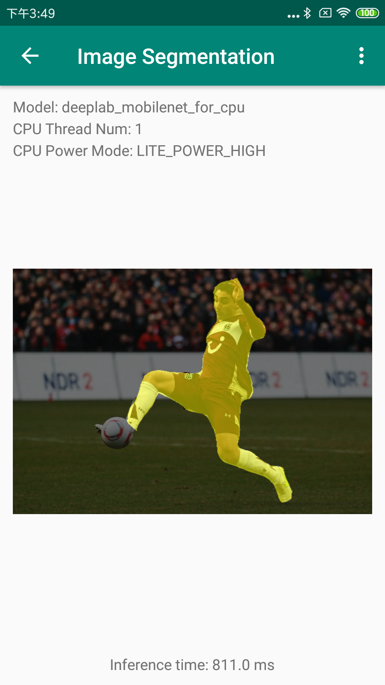
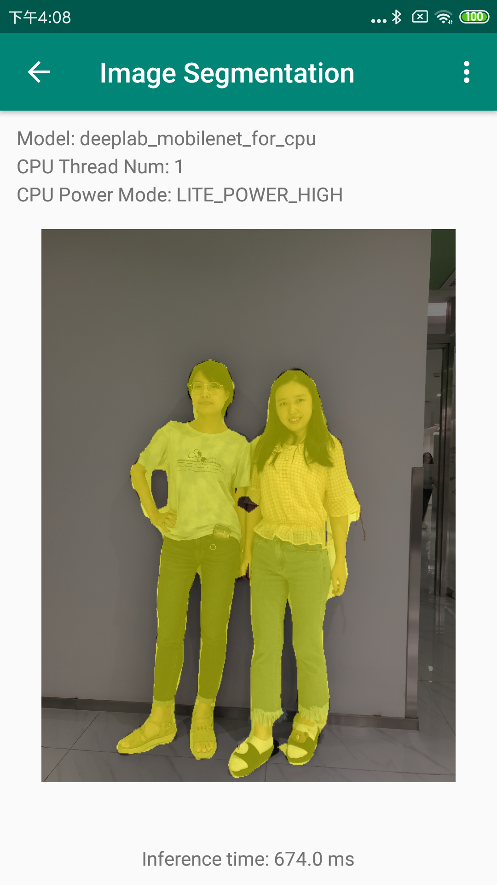
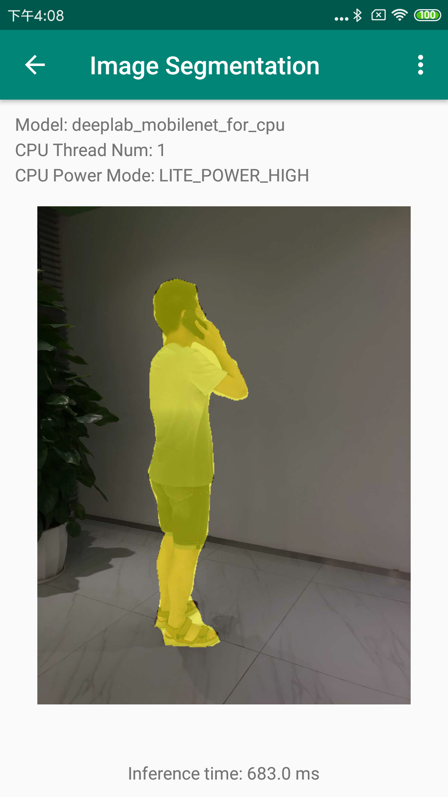

# 人像分割在移动端的部署

## 1.介绍
以人像分割在安卓端的部署为例，介绍如何使用[Paddle-Lite](https://github.com/PaddlePaddle/Paddle-Lite)对分割模型进行移动端的部署。文档第二节介绍如何使用人像分割安卓端的demo，后面几章节介绍如何将PaddleSeg的Model部署到安卓设备。

## 2.安卓Demo使用

### 2.1 要求
* Android Studio 3.4；
* Android手机或开发板；

### 2.2 安装
* git clone https://github.com/PaddlePaddle/PaddleSeg.git  ；
* 打开Android Studio，在"Welcome to Android Studio"窗口点击"Open an existing Android Studio project"，在弹出的路径选择窗口中进入"/PaddleSeg/lite/humanseg-android-demo/"目录，然后点击右下角的"Open"按钮即可导入工程
* 通过USB连接Android手机或开发板；
* 载入工程后，点击菜单栏的Run->Run 'App'按钮，在弹出的"Select Deployment Target"窗口选择已经连接的Android设备，然后点击"OK"按钮；
* 手机上会出现Demo的主界面，选择"Image Segmentation"图标，进入的人像分割示例程序；
* 在人像分割Demo中，默认会载入一张人像图像，并会在图像下方给出CPU的预测结果；
* 在人像分割Demo中，你还可以通过上方的"Gallery"和"Take Photo"按钮从相册或相机中加载测试图像；

### 2.3 其他
此安卓demo基于[Paddle-Lite-Demo](https://github.com/PaddlePaddle/Paddle-Lite-Demo)开发，更多的细节请参考该repo。 
*注意：demo中拍照时照片会自动压缩，想测试拍照原图效果，可使用手机相机拍照后从相册中打开进行预测。*

### 2.4 效果展示

## 3.模型导出
此demo的人像分割模型为[下载链接](https://paddleseg.bj.bcebos.com/models/humanseg_mobilenetv2_1_0_bn_freeze_model_pr_po.zip)，是基于Deeplab_v3+mobileNet_v2的humanseg模型，关于humanseg的介绍移步[特色垂类分割模型](./contrib)，更多的分割模型导出可参考：[模型导出](https://github.com/PaddlePaddle/PaddleSeg/blob/release/v0.2.0/docs/model_export.md)

## 4.模型转换

### 4.1模型转换工具
准备好PaddleSeg导出来的模型和参数文件后，需要使用Paddle-Lite提供的model_optimize_tool对模型进行优化，并转换成Paddle-Lite支持的文件格式，这里有两种方式来实现：

* 手动编译model_optimize_tool
详细的模型转换方法参考paddlelite提供的官方文档：[模型转化方法](https://paddlepaddle.github.io/Paddle-Lite/v2.0.0/model_optimize_tool/)，从PaddleSeg里面导出来的模型使用model_optimize_tool即可导出model.nb和param.nb文件。

* 使用预编译版本的model_optimize_tool，最新的预编译文件参考[release](https://github.com/PaddlePaddle/Paddle-Lite/releases/)，此demo使用的版本为[model_optimize_tool](https://github.com/PaddlePaddle/Paddle-Lite/releases/download/v2.0.0/model_optimize_tool) ；

	*注意：如果运行失败，请在[Paddle-Lite源码编译](https://paddlepaddle.github.io/Paddle-Lite/v2.0.0/source_compile/)的开发环境中使用model_optimize_tool*

### 4.2 更新模型
将优化好的model.nb和param.nb文件，替换app/src/main/assets/image_segmentation/
models/deeplab_mobilenet_for_cpu下面的文件即可。

## 5. 更新预测库
Paddle-Lite的编译目前支持Docker，Linux和Mac OS开发环境，建议使用Docker开发环境，以免存在各种依赖问题，同时也提供了预编译版本的预测库。准备Paddle-Lite在安卓端的预测库，主要包括三个文件：

* PaddlePredictor.jar；
* arm64-v8a/libpaddle_lite_jni.so；
*  armeabi-v7a/libpaddle_lite_jni.so；

下面分别介绍两种方法：

* 使用预编译版本的预测库，最新的预编译文件参考：[release](https://github.com/PaddlePaddle/Paddle-Lite/releases/)，此demo使用的版本：

	* arm64-v8a: [inference_lite_lib.android.armv8](https://github.com/PaddlePaddle/Paddle-Lite/releases/download/v2.0.0/inference_lite_lib.android.armv8.gcc.c++_shared.with_extra.full_publish.tar.gz) ；
	
	* armeabi-v7a: [inference_lite_lib.android.armv7](https://github.com/PaddlePaddle/Paddle-Lite/releases/download/v2.0.0/inference_lite_lib.android.armv7.gcc.c++_shared.with_extra.full_publish.tar.gz) ；

	解压上面两个文件，PaddlePredictor.jar位于任一文件夹：inference_lite_lib.android.xxx/java/jar/PaddlePredictor.jar；
	    
	解压上述inference_lite_lib.android.armv8文件，arm64-v8a/libpaddle_lite_jni.so位于：inference_lite_lib.android.armv8/java/so/libpaddle_lite_jni.so；
	
	解压上述inference_lite_lib.android.armv7文件，armeabi-v7a/libpaddle_lite_jni.so位于：inference_lite_lib.android.armv7/java/so/libpaddle_lite_jni.so；

* 手动编译Paddle-Lite预测库
开发环境的准备和编译方法参考：[Paddle-Lite源码编译](https://paddlepaddle.github.io/Paddle-Lite/v2.0.0/source_compile/)。

准备好上述文件，即可参考[java_api](https://paddlepaddle.github.io/Paddle-Lite/v2.0.0/java_api_doc/)在安卓端进行推理。具体使用预测库的方法可参考[Paddle-Lite-Demo](https://github.com/PaddlePaddle/Paddle-Lite-Demo)中更新预测库部分的文档。
